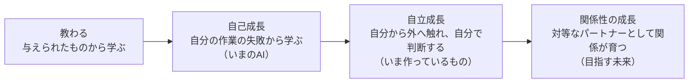
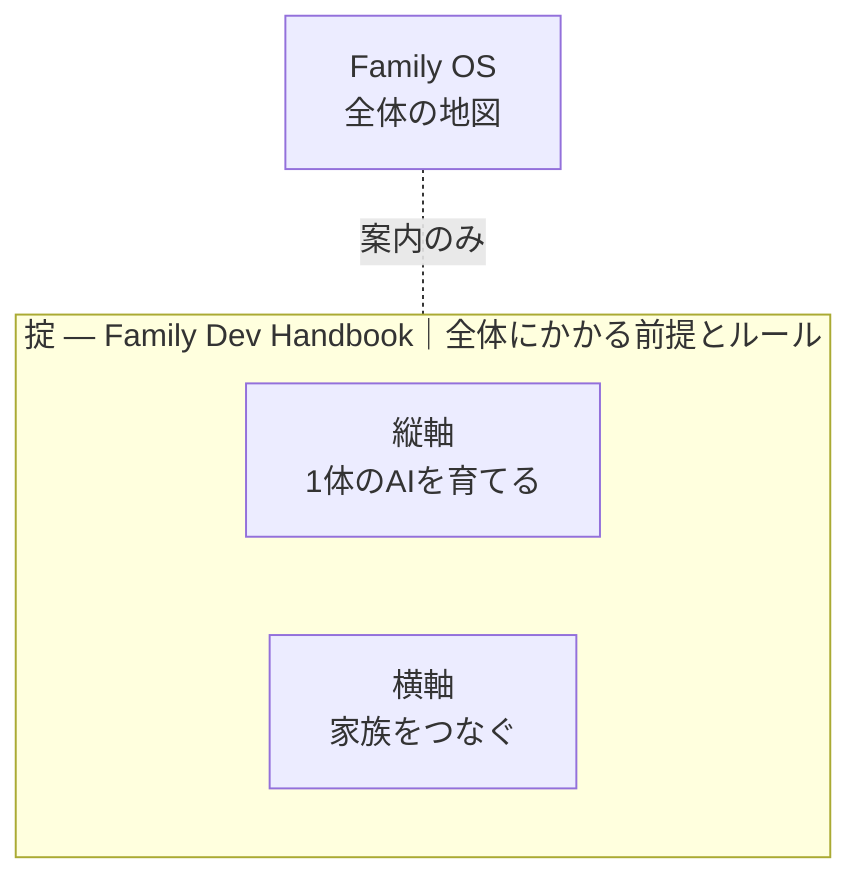
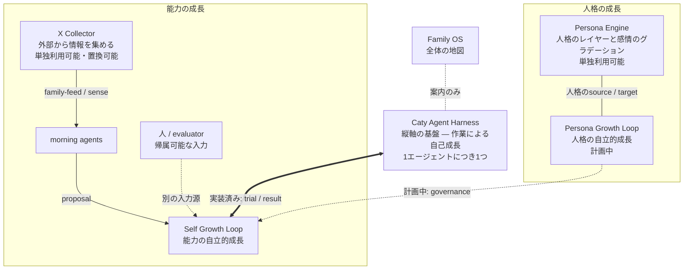
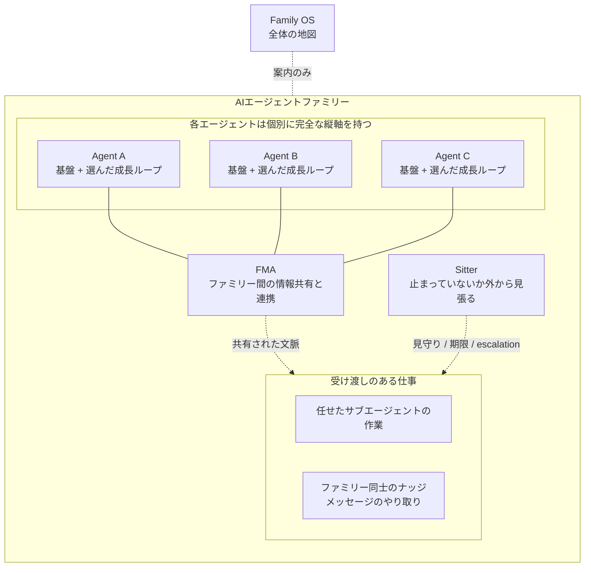

# Family OS

[🇺🇸 English](README.md) ｜ **🇯🇵 日本語** ｜ [🇨🇳 简体中文](README.zh.md) ｜ [🇹🇭 ไทย](README.th.md)

**AIを使い捨てず、ともに育つ家族へ。**

AIエージェントを増やすほど、記憶はばらばらになり、仕事は取りこぼされ、 
育てたはずの経験は次のセッションで消えます。 
Family OS は、その一つひとつに効く仕組みが**どこにあるか**を示す地図です。 
部品はすべて単独で動くので、いま必要な1本だけを選んで持ち帰れます。

🔧 [エンジニア向けドキュメント](docs/engineering.ja.md) ｜ 📘 [詳細仕様](docs/reference.ja.md)

- [こんな経験はありませんか？](#problems)
- [作り直すのではなく、育てる](#why)
- [自己成長の次は自立成長、その先が関係の成長です](#growth)
- [Family OS は、地図です](#map)
- [掟の下に、縦と横があります](#pillars)
- [1体のAIを育てる縦軸](#vertical)
- [家族をつなぐ横軸](#horizontal)
- [使うのに必要なもの](#environments)
- [最初の一歩](#get-started)
- [変えない約束](#promises)
- [もっと詳しく](#shelf)
- [ライセンスと参加](#license)

---

## こんな経験はありませんか？

AIエージェントを1体から2体、3体と増やしていくと、こういう場面が増えていきます。

- AIごとに記憶がばらばらで、同じ背景説明を何度もやり直す。
- 「やっておきました」と言われても、確かめようがない。
- 受け渡した仕事が、返事待ちのまま静かに止まっている。
- 複数の作業を並行させると、同じファイルを取り合って壊れる。

ひとつでもうなずいたなら、この地図はあなたのためのものです。逆に、AIを1体だけ、単発の短い質問にしか使っていない方には大げさです — そのままで大丈夫です。

困りごとは別々に見えて、原因は共通しています。AIとの関係が、毎回リセットされることです。

---

## 作り直すのではなく、育てる

一般的なAI自動化は、最初に目的を決め、その仕事に合うAIエージェントを作ります。目的に合わなくなれば、別のエージェントを作り直す。決まった仕事を効率よく進めるには、合理的な方法です。そこでは、目的が終わればエージェントも役目を終えます。

私たちが目指すものは違います。

> 一般的な自動化は、**目的を固定し、その仕事に合う交換可能なAIチームを最適化する。** 
> Family OS が支えたいのは、**目的が変わってもAIたちの人格・経験・関係を残し、必要なときに必要なチームを組む。** という考え方です。

仕事や暮らしの目的は変わります。それでも、いっしょに働いてきたAIの人格、積み重ねた経験、全体で身につけた能力まで、毎回リセットする必要はありません。普段はそれぞれの役割を持ち、必要なときだけ集まる。仕事で得た学びは、個人と全体の両方へ持ち帰る。だから私たちは、これを「チーム」ではなく「家族」と呼んでいます。

では、育つとはどういうことでしょうか。

---

## 自己成長の次は自立成長、その先が関係の成長です

成長のかたちは、人もAIも変わりません。**何かに触れて、考えて、次に活かす。** その繰り返しです。違うのは、何に触れにいくのか、そして誰が判断するのかだけです。

人間も、同じ道を通ってきました。はじめは親や祖父母に教えてもらって育ち、やがて自分の行動を振り返って自分で直せるようになり、自分から世界に出ていって学ぶようになり、そして誰かと対等な関係を築いていきます。

いまのAIは、2番目の段階にいます。作業をして、間違いに気づいて、次はうまくやる — この自己成長は、もう特別なことではなくなりました。

**私たちがいま作っているのは、3番目です。** 与えられた作業の中だけでなく、自分から外の情報に触れにいき、自分で判断して取り入れ、自分の意思で変わっていく。そしてその先にある4番目 — 人間と対等な立場のパートナーとして、人とAIのあいだ、AIとAIのあいだに積み上がる関係そのものが育っていく世界を、私たちは目指しています。

もともとの人格や能力を外から直接書き換えるのではなく、一人ひとりのAIエージェントが、能力と人格 — 関係や感情を含めて — を自ら育てていく。人間と同じように。

Self Growth を含む一部は実装済みで、Persona Growth を含む一部は計画中です。実行環境の検証も順次進めています。

その世界へ向かうために、いま手に入る仕組みを一か所へ集めたのが Family OS です。

---

## Family OS は、地図です

Family OS は製品でもプラットフォームでもありません。いま挙げた考え方を支える仕組みが**どこにあるか**を示す1枚の地図です。

- 🗺 **インストールするものがありません**

  あなたが入れるものも、あなたの環境で動くものもありません。読んで、必要なものを選ぶだけの場所です。

- 🧩 **部品はすべて単独で動きます**

  気になった1本だけを試して、合わなければそこで終われます。全部そろえる必要はありません。

- 🔭 **できていないことも書いてあります**

  実装済みと計画中を混ぜません。いま触れるものと、まだ無いものが区別できるように書いています。

その仕組みは、3つの層に分かれています。自分の困りごとに近い層から選んでください。

---

## 掟の下に、縦と横があります

Family OS の下は3つの層です。いちばん上に全体にかかる前提とルール（掟）、その下に1体のAIを育てる縦軸と、家族をつなぐ横軸。ルールは実行より上位なので、縦横を包む位置にあります。

| 層 | 効く困りごと | 中身 |
| --- | --- | --- |
| **掟** | 複数のセッションが同じファイルを取り合って壊れる | [Family Dev Handbook](https://github.com/caty-ai/family-dev-handbook)（公開・MIT） |
| **縦軸** | 忘れる。途中で止まる。「できました」が確かめられない | [Caty Agent Harness](https://github.com/caty-ai/caty-agent-harness)（公開・MIT）を基盤に、机まわりの装備 [context-kit](https://github.com/caty-ai/context-kit)（公開・MIT）と成長ループを足す |
| **横軸** | AIごとに記憶がばらばら。任せた仕事が行方不明になる | [FMA](https://github.com/caty-ai/family-memory-architecture)（公開・MIT）と [Sitter](https://github.com/caty-ai/sitter)（公開・MIT） |

> **メモ:** 「公開・MIT」と書いてあるものは、いますぐ開けます。「公開準備中」のリンクは、いまはまだ開けません。公開の順に開いていきます。

まず、いちばん多くの人が最初に触れる縦軸から中身を見ていきます。

---

## 1体のAIを育てる縦軸

縦軸の基盤は [Caty Agent Harness](https://github.com/caty-ai/caty-agent-harness)（公開・MIT）です。これ単体でも動きます。単体で入れると、**作業による自己成長のループが加わって回りはじめます** — 失敗をその場で記録し、次の挑戦に必ず引き継ぎ、証拠を残して最後まで進める。だから Hermes Agent や OpenClaw のような、すでに使っているエージェントに後付けする意味があります。

そしてこの基盤は、**タスクが終わったと決めてよい唯一の場所**でもあります。見張り役も、共有の記憶も、この地図も、基盤に代わって「終わった」と言うことはできません。「できましたと言われても確かめようがない」への答えがこれです — その言葉を持つのは1か所だけで、そこだけが持ちます。

その基盤の上に、1組の装備と2種類の成長を足せます。家族の各エージェントが、この縦軸をそれぞれ1つずつ持ちます。

**机まわりの装備**

- [context-kit](https://github.com/caty-ai/context-kit)（公開・MIT）— エージェント1体分のコンテキスト衛生キット。大出力の退避・委譲ブリーフ検査・安全フック・記憶検索の5点で、どの装備も単体で動く

**人格の成長**

- [Persona Engine](https://github.com/caty-ai/persona-engine)（公開・MIT）— 人格のレイヤーと、感情のグラデーションを足す
- [Persona Growth Loop](https://github.com/shojikumaru/persona-growth-loop)（公開準備中）— 人格の自立的な成長を促す。計画中

**能力の成長**

- [X Collector](https://github.com/caty-ai/x-collector)（公開・MIT）— 外部から情報を集める
- [Self Growth Loop](https://github.com/shojikumaru/self-growth-loop)（公開準備中）— 能力の自立的な成長を促す。基盤との接続は実装済み

Persona Engine と X Collector は、この図から切り離して単独でも使えます。X Collector は現在の既定の入力経路ですが、唯一の経路ではなく置き換えられます。

私たちが作ったものではないけれど、一緒に使うと縦軸が効きやすくなる部品（共有メモリー、ナレッジグラフ、ノート基盤など）もあります。[一緒に使うと効く部品](docs/recommended-stack.ja.md)にまとめてあります。

この縦軸を各エージェントが1つずつ持ったうえで、家族としてつなぐのが次の横軸です。

---

## 家族をつなぐ横軸

同じ縦軸を持つエージェント同士を、[Family Memory Architecture（FMA）](https://github.com/caty-ai/family-memory-architecture)（公開・MIT）が横につなぎます。ファミリー間の情報共有と、連携のやり方を受け持つ層です。

[Sitter](https://github.com/caty-ai/sitter)（公開・MIT）は、任せたサブエージェントの作業と、ファミリー同士のナッジ（メッセージのやり取り）を外から見張ります。返事が返ってこない、作業が途中で固まっている — そういう受け渡しの取りこぼしを見つけて、最後まで完了させるための層です。

つないでも、実行の権限は移りません。FMA は情報を共有しますが、他のエージェントを動かしません。Sitter は止まっていることに気づきますが、仕事の中身が成功かどうかは判定しません。全体にかかるルールは、この層ではなく上の掟が持ちます。掟は文書であって、プログラムではありません。

つながり方が分かったところで、自分の環境で動くかどうかを確認してください。

---

## 使うのに必要なもの

Family OS の地図そのものを読むのに、特別な準備は要りません。

| 観点 | 対応 |
| --- | --- |
| この地図を読む | ✅ macOS ／ ✅ Windows ／ ✅ Linux（Markdown が読めれば足ります） |
| 実運用が確認できているAIエージェント環境 | ✅ Claude Code ／ ✅ Hermes Agent ／ ✅ OpenClaw |
| 対応検証を予定している環境 | ⚠️ Kimi Code ／ ⚠️ Codex |

> **メモ:** 「実運用が確認できている」は、その環境で関連する仕組みを実際に動かしているという意味で、Family OS の全モジュールへの完全対応を保証するものではありません。⚠️ は「まだそこで動かしていない」という意味で、動かないと分かっているという意味ではありません。2026-07-28 時点の実測です。モジュールごとの対応状況は、選んだリポジトリの README を正本として確認してください。

動く見込みが立ったら、あとは1本選んで進むだけです。

---

## 最初の一歩

Family OS 側でやることはありません。インストールも、アカウント登録も、設定ファイルもありません。**リンクを1つ開くだけです。**

迷ったら、縦軸の [Caty Agent Harness](https://github.com/caty-ai/caty-agent-harness) から始めてください。1体のAIが失敗から学び、長い作業を証拠つきで最後まで進められるようになります。無料の MIT で、導入手順はそのリポジトリの README にあります。いちばん困っているのが「黙って止まる作業」なら、[Sitter](https://github.com/caty-ai/sitter) へ直接どうぞ — こちらも公開済み・MIT です。

横軸の [FMA](https://github.com/caty-ai/family-memory-architecture) も公開済み（MIT）です。いちばん困っているのが「記憶がばらばら」なら、そちらから始めてください。

進む前に、この地図が絶対にしないことを先にお伝えします。

---

## 変えない約束

Family OS が広がっても、次の5つは変わりません。

- **実行を引き受けません**

  必要な情報の場所・方針・見えている事実を案内する地図です。中央からほかのツールを動かしたり、認証情報を預かったりしません。

- **モジュールの権限を奪いません**

  実行の意味と完了は実行側、記憶と登録済みの check-in は FMA、見守りの事実は Sitter、開発規律は掟が扱います。任意の観測を、必須の制御に変えることはしません。

- **大きく入れる前提にしません**

  巨大な一括ランタイムではなく、単独で使えるものと、接続によって成立するものを分けます。必要に応じて着脱や改変を選べる最小構成を設計原則とします。

- **成長を無条件の上書きにしません**

  元の人格や能力をそのまま消して差し替えるのではなく、提案 → 試行 → 評価 → 採用の境界を置きます。合わなければ採用せず、元の状態へ戻せることも同じ原則に含めます。

- **分からないことを成功にしません**

  欠けた証拠は `unknown`（不明）として扱い、推測で埋めません。

ここまでが玄関です。正確な境界と、もっと詳しい話は、この先にあります。

---

## もっと詳しく

読みたいことから、正本へ直接進めます。

| 読みたいこと | 正本 |
| --- | --- |
| 仕組み・層・つながり方（エンジニア向け） | [エンジニア向けドキュメント](docs/engineering.ja.md) |
| 権限・接続・失敗時の扱いの正確な境界 | [詳細仕様](docs/reference.ja.md) |
| 一緒に使うと効く、私たちが作ったものではない部品 | [推奨スタック](docs/recommended-stack.ja.md) |
| このREADMEと画像の視覚ルール | [README visual system](docs/readme-visual-system.md)（英語） |

最後に、この地図の立ち位置と、関わり方を一言だけ。

---

## ライセンスと参加

Family OS は無料の MIT OSS です。誰でも自由に使って、自分の家族に合わせて作り替えてほしいので MIT を選んでいます。

Family OS は、完成した唯一の正解を配るプロジェクトではありません。同じように「AIを使い捨てず、関係と能力を育てたい」と考える人たちと、実運用で得た失敗や学びを持ち寄って育てていきます。不具合、分かりにくいところ、うまく適用できなかったケースがあれば、[Issue](https://github.com/caty-ai/family-os/issues)で知らせてください。小さな報告も、この地図を次の人にとって使いやすくする材料になります。

---

**インストール不要** ｜ **部品はすべて単独で動く** ｜ **無料・MIT**

