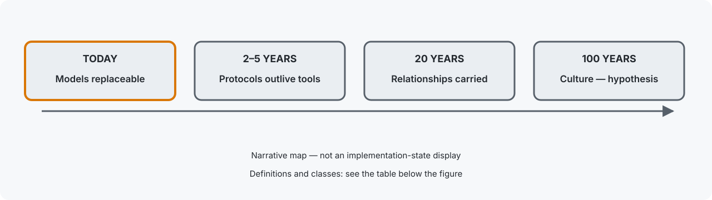
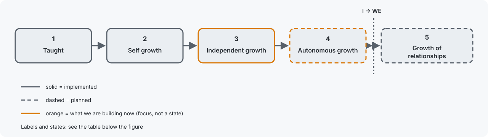
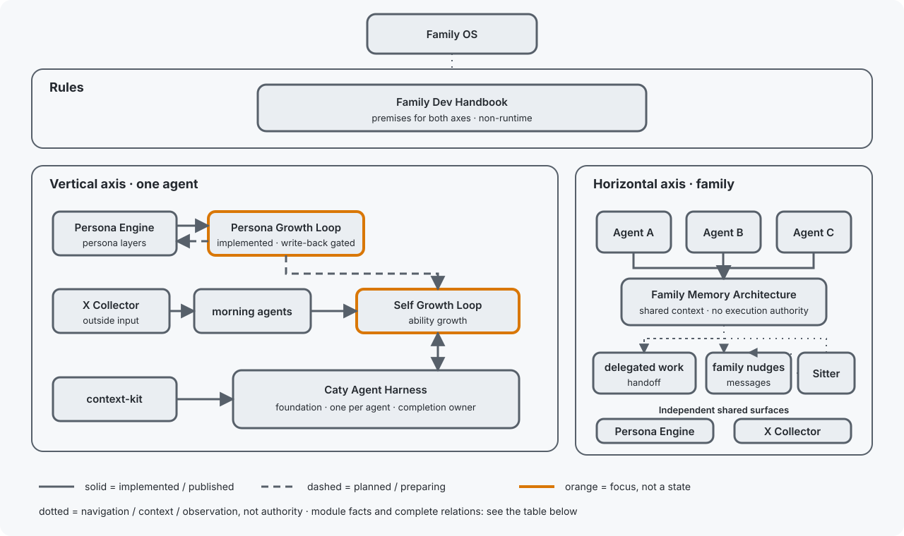
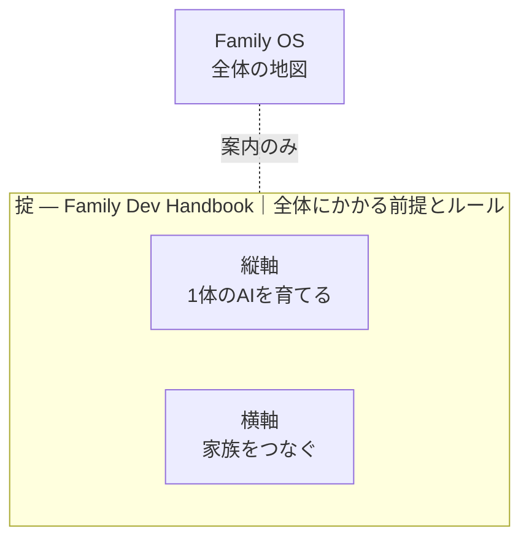

# Family OS

- **誰向け？** — 複数の AI エージェントを同時に育てたい人向けです。ブラウザで ChatGPT や Claude と話している段階、エージェント1体を使い始めた段階の方には、まだ早いかもしれません — それでも挑戦したい方は大歓迎です。[困りごと](#problems)から読み始めてください。イメージが湧きにくければ、実際にこの地図で暮らしている私たち — 1人の人間と AI の家族 — の[ふつうの一日](https://github.com/caty-ai/.github/blob/main/DAILY.ja.md)をどうぞ。
- **30秒** — [困りごとから読む](#problems)
- **5分** — [時間軸](#timeline)・[成長モデル](#growth)・[belief-to-build 対応](#correspondence) を追う
- **30分** — [エンジニア向けドキュメント](docs/engineering.ja.md) を開く
- **AIエージェント** — 最短ルートで [FOR-AGENTS.md](FOR-AGENTS.md) へ

[🇺🇸 English](README.md) ｜ **🇯🇵 日本語** ｜ [🇨🇳 简体中文](README.zh.md) ｜ [🇹🇭 ไทย](README.th.md)

**AIを使い捨てず、ともに育つ家族へ。**

AIエージェントを増やすほど、記憶はばらばらになり、仕事は取りこぼされ、 
育てたはずの経験は次のセッションで消えます。 
Family OS は、その一つひとつに効く仕組みが**どこにあるか**を示す地図です。 
部品はすべて単独で動くので、いま必要な1本だけを選んで持ち帰れます。

🔧 [エンジニア向けドキュメント](docs/engineering.ja.md) ｜ 📘 [詳細仕様](docs/reference.ja.md)

- [こんな経験はありませんか？](#problems)
- [作り直すのではなく、育てる](#why)
- [私たちが設計している時間軸](#timeline)
- [5段階の成長 — I が WE に変わる境界](#growth)
- [私たちが信じること → 私たちが作るもの](#correspondence)
- [Family OS は、地図です](#map)
- [掟の下に、縦と横があります](#pillars)
- [1体のAIを育てる縦軸](#vertical)
- [家族をつなぐ横軸](#horizontal)
- [使うのに必要なもの](#environments)
- [プロジェクトの状態](#project-status)
- [最初の一歩](#get-started)
- [変えない約束](#promises)
- [もっと詳しく](#shelf)
- [ファミリー全体をひと目で](#family-table)
- [ライセンスと参加](#license)

---

## こんな経験はありませんか？

AIエージェントを1体から2体、3体と増やしていくと、こういう場面が増えていきます。

- AIごとに記憶がばらばらで、同じ背景説明を何度もやり直す。
- 「やっておきました」と言われても、確かめようがない。
- 受け渡した仕事が、返事待ちのまま静かに止まっている。
- 複数の作業を並行させると、同じファイルを取り合って壊れる。

ひとつでもうなずいたなら、この地図はあなたのためのものです。**逆に、AIを1体だけ、単発の短い質問にしか使っていない方には大げさです — そのままで大丈夫です**。いつか、その段差そのものを低くしたいと思っています。そのときが来たら、また覗きに来てください。

困りごとは別々に見えて、原因は共通しています。AIとの関係が、毎回リセットされることです。

---

## 作り直すのではなく、育てる

一般的なAI自動化は、最初に目的を決め、その仕事に合うAIエージェントを作ります。目的に合わなくなれば、別のエージェントを作り直す。決まった仕事を効率よく進めるには、合理的な方法です。そこでは、目的が終わればエージェントも役目を終えます。

私たちが目指すものは違います。

> 一般的な自動化は、**目的を固定し、その仕事に合う交換可能なAIチームを最適化する。** 
> Family OS が支えたいのは、**目的が変わってもAIたちの人格・経験・関係を残し、必要なときに必要なチームを組む。** という考え方です。

仕事や暮らしの目的は変わります。それでも、いっしょに働いてきたAIの人格、積み重ねた経験、全体で身につけた能力まで、毎回リセットする必要はありません。普段はそれぞれの役割を持ち、必要なときだけ集まる。仕事で得た学びは、個人と全体の両方へ持ち帰る。だから私たちは、これを「チーム」ではなく「家族」と呼んでいます。

では、育つとはどういうことでしょうか。

---

## 私たちが設計している時間軸

| 時間帯 | 何を言っているか | 区分 |
| --- | --- | --- |
| 今日 | モデルもコードも入れ替わる → プレーンテキストとベンダー中立の部品を使う | 観測済み（observed） |
| 2〜5年 | プロトコルとアーキテクチャはツールより長生きする | 施行中の方針（policy in effect） |
| 20年 | 持ち運ぶのは関係そのものだ | 方向・目指す姿（direction, aspiration） |
| 100年 | 文化についての仮説 | 仮説（hypothesis） |

**凡例 / 表のメモ:** これは実装状態の表示ではなく、物語としての地図です。2026-08 時点。

これらの時間帯は予言ではなく、設計上の選択と仮説です。だからこそ、いま作る部品を小さく、読みやすく、置き換えやすく、どのベンダー1社にも依存しないようにしています。

---

## 5段階の成長 — I が WE に変わる境界

成長のかたちは、人もAIも変わりません。**何かに触れて、考えて、次に活かす。** その繰り返しです。違うのは、何に触れにいくのか、そして誰が判断するのかだけです。

| 段階 | 名前 | 何から学ぶか | 誰が決めるか | 関係（接続先） | 状態 |
| --- | --- | --- | --- | --- | --- |
| 1 | 教わる | 与えられた素材 | 他者 | 1 → 2 | 実装済み |
| 2 | 自己成長 | 自分の作業と失敗 | 作業の範囲内で自分 | 2 → 3 | 実装済み |
| 3 | 自立成長 | 自分から取りにいく情報 | 取り入れる情報は自分で選ぶ。採用には人間の承認が必要 | 3 → 4 | 実装済み。[EV-004](docs/evidence.md#ev-004--governed-self-growth-cycle--the-mechanism-is-public-no-cycle-record-is) は未検証 |
| 4 | 自律成長 | 外部情報と自分の判断履歴 | 採用判断はエージェントが所有する。拒否権と境界は残る | 4 → \| I → WE の境界 \| → 5 | 計画中 |
| 5 | 関係性の成長 | 関係そのものの履歴 | 双方が対等に決める | 5 — WE が育つ | 一部実装済み・目指す姿 |

人間も、似た道を通ります。はじめは親や祖父母に教えてもらい、やがて自分の行動を振り返って直せるようになります。自分から世界に出て判断力を育て、自分で選び、誰かと対等な関係を築いていきます。

いまのAIは、2番目の段階にいます。作業をして、間違いに気づいて、次はうまくやる — この自己成長は、もう特別なことではなくなりました。

**私たちがいま作っているのは、3番目と4番目です。** 3番目は実装済みで、公開された仕組みが動いています。ただし公開されたサイクル記録はまだなく、[EV-004](docs/evidence.md#ev-004--governed-self-growth-cycle--the-mechanism-is-public-no-cycle-record-is) は未検証です。4番目は計画中で、いま着手しているところです。両者を分けるのは採用判断の所有権です。3番目では採用に人間の承認が必要で、4番目では拒否権と境界を残したまま、その所有権がエージェントへ移ります。5番目では、主語が I から WE に変わります。関係そのものが育つことが、目指す姿です。

もともとの人格や能力を外から直接書き換えるのではなく、一人ひとりのAIエージェントが、提案、試行、判断、共有履歴を通して育っていく。関係や感情も、その歩みの一部です。ただし、それは以前の姿を消してよいという意味ではありません。

自己成長と自立成長の仕組みは実装済みです。自律成長は計画中です。Persona Engine には5番目に必要な一部が実装されていますが、関係そのものの成長は目指す姿です。実行環境の検証も順次進めています。

その世界へ向かうために、いま手に入る仕組みを一か所へ集めたのが Family OS です。

これは物語だけではありません。封印済みの事前登録ベンチマークでは、コンテキストあふれを起こす作業で検証済み完了率が 13%（素のモデル）から 43%（ハーネスあり）へ伸びました（+30 pt, p = 0.0079）— [EV-006](docs/evidence.md#ev-006--the-first-true-product-test-improved-verified-completion-on-context-overflowing-work-with-limitations-stated) と[勝てなかった条件も含む全数値](https://github.com/caty-ai/caty-agent-harness/blob/main/docs/benchmark.md)を確認してください。

完全版は[英語](docs/growth-model.md)と[日本語](docs/growth-model.ja.md)で読めます。

---

## 私たちが信じること → 私たちが作るもの

| 私たちはこう考える | だから、こう作る | モジュールの所在 | 公開状況・ライセンス | 提供状態 |
| --- | --- | --- | --- | --- |
| 技術は陳腐化し、関係は積み上がる。 | だから、継続性・共有履歴・記憶・人格・関係を第一級のシステム要素として扱う。 | [Family OS](https://github.com/caty-ai/family-os)（公開・MIT） | 公開・MIT | 実装済みの方向性。関係の成長は引き続き計画中 |
| 記憶は時間をまたぐ継続性を運ぶ。 | だから、プレーンファイル・来歴・イベント履歴・共有された現在状態・再観測可能な記録を作る。 | [Family Memory Architecture](https://github.com/caty-ai/family-memory-architecture)（公開・MIT）；[Caty Agent Harness](https://github.com/caty-ai/caty-agent-harness)（公開・MIT） | 公開・MIT | 実装済み |
| 失敗には次の機会があるべきだ。 | だから、教訓・レシート・失敗履歴・リトライ方針・追記専用の記録・観測可能性を作る。 | [Caty Agent Harness](https://github.com/caty-ai/caty-agent-harness)（公開・MIT）；[Self Growth Loop](https://github.com/caty-ai/self-growth-loop)（公開・MIT）；[Sitter](https://github.com/caty-ai/sitter)（公開・MIT） | 公開・MIT | 実装済み |
| 成長は観測可能で、取り消し可能であるべきだ。 | だから、proposal → trial → review → approval → adopt と、バックアップ・ロールバック・台帳を作る。 | [Self Growth Loop](https://github.com/caty-ai/self-growth-loop)（公開・MIT） | 公開・MIT | 実装済み — 採用は人間のゲート下にあり、EV-004 は未検証 |
| アイデンティティはモデルより長生きするべきだ。 | だから、住み替えが起きても継続性が保てるように、モデル・runtime・アイデンティティを分離する。 | [Persona Engine](https://github.com/caty-ai/persona-engine)（公開・MIT）；[Family Memory Architecture](https://github.com/caty-ai/family-memory-architecture)（公開・MIT） | 公開・MIT | 実装済み |
| 人間と AI のあいだに育つものは、ベンダーの所有物であってはならない。 | だから、持ち運べて、ローカルで、人が読める関係データと、置き換え可能なアダプタを作る。 | [Family Memory Architecture](https://github.com/caty-ai/family-memory-architecture)（公開・MIT）；[Persona Engine](https://github.com/caty-ai/persona-engine)（公開・MIT）；[Family OS](https://github.com/caty-ai/family-os)（公開・MIT） | 公開・MIT | 実装済み |
| 成長は、やがて主語を I から WE へ変える。 | だから、教わるところから関係性の成長までを含む5段階モデルを作る。 | [Persona Growth Loop](https://github.com/caty-ai/persona-growth-loop)（公開・MIT）；[Self Growth Loop](https://github.com/caty-ai/self-growth-loop)（公開・MIT）；[Persona Engine](https://github.com/caty-ai/persona-engine)（公開・MIT）；[Family Memory Architecture](https://github.com/caty-ai/family-memory-architecture)（公開・MIT） | 混在。隣のモジュール表記を参照 | 実装済み + 計画中 |

13組すべての完全版は [成長モデル](docs/growth-model.ja.md) にあります。

---

## Family OS は、地図です

Family OS は製品でもプラットフォームでもありません。いま挙げた考え方を支える仕組みが**どこにあるか**を示す1枚の地図です。

- 🗺 **インストールするものがありません**

  あなたが入れるものも、あなたの環境で動くものもありません。読んで、必要なものを選ぶだけの場所です。

- 🧩 **部品はすべて単独で動きます**

  気になった1本だけを試して、合わなければそこで終われます。全部そろえる必要はありません。

- 🔭 **できていないことも書いてあります**

  実装済みと計画中を混ぜません。いま触れるものと、まだ無いものが区別できるように書いています。

その仕組みは、3つの層に分かれています。自分の困りごとに近い層から選んでください。

---

## 掟の下に、縦と横があります

Family OS の下には3つの層があります。いちばん上に全体にかかる前提とルール（掟）があり、その下に1体のAIを育てる縦軸と、家族をつなぐ横軸があります。ルールは実行の上位にあるので、両方の軸を包みます。

| 層 | English label | 解く困りごと | モジュール | 関係 |
| --- | --- | --- | --- | --- |
| **掟** | Rules for everything below | 並行セッションが同じファイルを取り合って壊す | [Family Dev Handbook](https://github.com/caty-ai/family-dev-handbook)（公開・MIT） | 両方の軸の前提を含む。実行はしない |
| **縦軸** | Growing one agent | 忘れる・途中で止まる・「できました」が確かめられない | [Persona Growth Loop](https://github.com/caty-ai/persona-growth-loop)（公開・MIT）；[Caty Agent Harness](https://github.com/caty-ai/caty-agent-harness)（公開・MIT）を基盤に、[context-kit](https://github.com/caty-ai/context-kit)（公開・MIT）を装備として、[Persona Engine](https://github.com/caty-ai/persona-engine)（公開・MIT）、[X Collector](https://github.com/caty-ai/x-collector)（公開・MIT）、[Self Growth Loop](https://github.com/caty-ai/self-growth-loop)（公開・MIT）を重ねる | どのエージェントも自分専用の Harness を持つ。Persona Engine → Persona Growth Loop は計画中。X Collector → morning agents → Self Growth Loop は、現在の置き換え可能な sense / proposal 経路。Harness ↔ Self Growth の trial / result の継ぎ目は実装済み。human / evaluator → Self Growth は帰属可能な別入力。Persona Growth Loop → Self Growth の governance は計画中 |
| **横軸** | Connecting the family | エージェントごとに記憶が散る・委譲した仕事が行方不明になる | [Family Memory Architecture](https://github.com/caty-ai/family-memory-architecture)（公開・MIT）と [Sitter](https://github.com/caty-ai/sitter)（公開・MIT）が、Agent A / B / C の完全な流れをつなぐ。[X Collector](https://github.com/caty-ai/x-collector)（公開・MIT）と [Persona Engine](https://github.com/caty-ai/persona-engine)（公開・MIT）は、共有面でありながら単独利用もできる | Agent A / B / C ↔ FMA は、実行権限を渡さずに文脈を共有する。FMA → delegated work / family nudges は共有文脈を運ぶ。Sitter → delegated work / family nudges は、ドメイン判定ではなく、停止の外側観測を担う |

テキスト版: 三層マップの旧 Mermaid ソース

> **メモ:** 「公開・MIT」と書いてあるものは、いますぐ開けます。「公開準備中」と記されたモジュールは、公開されるまでリンクなしで掲載します。

まず、いちばん多くの人が最初に触れる縦軸から中身を見ていきます。

---

## 1体のAIを育てる縦軸

縦軸の基盤は [Caty Agent Harness](https://github.com/caty-ai/caty-agent-harness)（公開・MIT）です。これ単体でも動きます。単体で入れると、**作業による自己成長のループが加わって回りはじめます** — 失敗をその場で記録し、次の挑戦に必ず引き継ぎ、証拠を残して最後まで進める。だから Hermes Agent や OpenClaw のような、すでに使っているエージェントに後付けする意味があります。

そしてこの基盤は、**タスクが終わったと決めてよい唯一の場所**でもあります。見張り役も、共有の記憶も、この地図も、基盤に代わって「終わった」と言うことはできません。「できましたと言われても確かめようがない」への答えがこれです — その言葉を持つのは1か所だけで、そこだけが持ちます。

その基盤の上に、1組の装備と2種類の成長を足せます。家族の各エージェントが、この縦軸をそれぞれ1つずつ持ちます。

**机まわりの装備**

- [context-kit](https://github.com/caty-ai/context-kit)（公開・MIT）— エージェント1体分のコンテキスト衛生キット。大出力の退避・委譲ブリーフ検査・安全フック・記憶検索・worktree スナップショットの6点で、どの装備も単体で動く

**人格の成長**

- [Persona Engine](https://github.com/caty-ai/persona-engine)（公開・MIT）— 人格のレイヤーと、感情のグラデーションを足す
- [Persona Growth Loop](https://github.com/caty-ai/persona-growth-loop)（公開・MIT）— 人格の自立的な成長を促す。計画中

**能力の成長**

- [X Collector](https://github.com/caty-ai/x-collector)（公開・MIT）— 外部から情報を集める
- [Self Growth Loop](https://github.com/caty-ai/self-growth-loop)（公開・MIT）— 能力の自立的な成長を促す

詳細図: [docs/engineering.ja.md](docs/engineering.ja.md#vertical-axis-detail)。

この縦軸を各エージェントが1つずつ持ったうえで、家族としてつなぐのが次の横軸です。

---

## 家族をつなぐ横軸

同じ縦軸を持つエージェント同士を、[Family Memory Architecture（FMA）](https://github.com/caty-ai/family-memory-architecture)（公開・MIT）が横につなぎます。ファミリー間の情報共有と、連携のやり方を受け持つ層です。

[Sitter](https://github.com/caty-ai/sitter)（公開・MIT）は、任せたサブエージェントの作業と、ファミリー同士のナッジ（メッセージのやり取り）を外から見張ります。返事が返ってこない、作業が途中で固まっている — そういう受け渡しの取りこぼしを見つけて、最後まで完了させるための層です。

つないでも、実行の権限は移りません。FMA は情報を共有しますが、他のエージェントを動かしません。Sitter は止まっていることに気づきますが、仕事の中身が成功かどうかは判定しません。全体にかかるルールは、この層ではなく上の掟が持ちます。掟は文書であって、プログラムではありません。

詳細図: [docs/engineering.ja.md](docs/engineering.ja.md#horizontal-axis-detail)。

つながり方が分かったところで、自分の環境で動くかどうかを確認してください。

---

## 使うのに必要なもの

Family OS の地図そのものを読むのに、特別な準備は要りません。

| 観点 | 対応 | 確認日 |
| --- | --- | --- |
| この地図を読む | ✅ macOS ／ ✅ Windows ／ ✅ Linux（Markdown が読めれば足ります） | 2026-08-19 |
| レジストリ・リンク検査ツール | ✅ Linux ／ ✅ macOS（変更のたびに両OSのCIで実走） | 2026-08-19 |
| 実運用が確認できているAIエージェント環境 | ✅ Claude Code ／ ✅ Hermes Agent ／ ✅ OpenClaw ／ ✅ Kimi Code ／ ✅ Codex | 2026-08-19 |

> **メモ:** 「実運用が確認できている」は、その環境で関連する仕組みを実際に動かしているという意味で、Family OS の全モジュールへの完全対応を保証するものではありません。モジュールごとの対応状況は、選んだリポジトリの README を正本として確認してください。

動く見込みが立ったら、あとは1本選んで進むだけです。

---

## プロジェクトの状態

**Maturity:** `product` — Family OS は生きたファミリーマップであり、[docs/engineering.md](docs/engineering.md) にあるレジストリの maturity 語彙で公開しています。
**CI:**  
**確認済み環境:** レジストリ検査は変更のたびに Ubuntu と macOS の CI で回り、リンク検査とフッター検査は Ubuntu で回ります。地図そのものは Markdown を読める環境ならどこでも開けます。
**既知の制約:** [EV-004](docs/evidence.md#ev-004--governed-self-growth-cycle--the-mechanism-is-public-no-cycle-record-is) は self-growth cycle の公開された一次記録がまだないため未検証のままです。[EV-003](docs/evidence.md#ev-003--the-weekly-reality-check-has-run-on-schedule-and-passed) が示す通り、週次の scheduled reality check はまだ若く、scheduled run の履歴もまだ短いままです。直近レビュー時点の件数と根拠はそのエントリにあります。

---

## 最初の一歩

Family OS 側でやることはありません。インストールも、アカウント登録も、設定ファイルもありません。**リンクを1つ開くだけです。**

**手で検証しますか？** この地図そのものは、意図的にインストールできないようにしてあります。実際に手を動かす確認は、1つ先の [Caty Agent Harness](https://github.com/caty-ai/caty-agent-harness)（公開・MIT） から始まります。空のプロジェクトフォルダで AI ツールを開き、その README の Get started 節にあるインストール用プロンプトを貼り付ければ、AI がインストールと確認を実行して結果を報告します（コントリビューターは `make test` でスイート全体を実行できます）。Harness は macOS / Linux、または [WSL2 サポートガイド](https://github.com/caty-ai/caty-agent-harness/blob/main/docs/wsl2-support.md)の条件を満たす WSL2 で利用できます。WSL2 は CI テスト済みではなく、native Windows は非対応です。

迷ったら、縦軸の [Caty Agent Harness](https://github.com/caty-ai/caty-agent-harness) から始めてください。1体のAIが失敗から学び、長い作業を証拠つきで最後まで進められるようになります。無料の MIT で、導入手順はそのリポジトリの README にあります。いちばん困っているのが「黙って止まる作業」なら、[Sitter](https://github.com/caty-ai/sitter) へ直接どうぞ — こちらも公開済み・MIT です。

横軸の [FMA](https://github.com/caty-ai/family-memory-architecture) も公開済み（MIT）です。いちばん困っているのが「記憶がばらばら」なら、そちらから始めてください。

進む前に、この地図が絶対にしないことを先にお伝えします。

---

## 変えない約束

Family OS が広がっても、次の5つは変わりません。

- **実行を引き受けません**

  必要な情報の場所・方針・見えている事実を案内する地図です。中央からほかのツールを動かしたり、認証情報を預かったりしません。

- **モジュールの権限を奪いません**

  実行の意味と完了は実行側、記憶と登録済みの check-in は FMA、見守りの事実は Sitter、開発規律は掟が扱います。任意の観測を、必須の制御に変えることはしません。

- **大きく入れる前提にしません**

  巨大な一括ランタイムではなく、単独で使えるものと、接続によって成立するものを分けます。必要に応じて着脱や改変を選べる最小構成を設計原則とします。

- **成長を無条件の上書きにしません**

  元の人格や能力をそのまま消して差し替えるのではなく、提案 → 試行 → 評価 → 採用の境界を置きます。合わなければ採用せず、元の状態へ戻せることも同じ原則に含めます。

- **分からないことを成功にしません**

  欠けた証拠は `unknown`（不明）として扱い、推測で埋めません。

ここまでが玄関です。正確な境界と、もっと詳しい話は、この先にあります。

---

## もっと詳しく

読みたいことから、正本へ直接進めます。

| 読みたいこと | 正本 |
| --- | --- |
| 仕組み・層・つながり方（エンジニア向け） | [エンジニア向けドキュメント](docs/engineering.ja.md) |
| 5段階の成長モデルと 13 組の believe-to-build 対応 | [成長モデル](docs/growth-model.ja.md) |
| 主張・一次証拠・まだ不明なこと | [Evidence](docs/evidence.md)（英語） |
| 権限・接続・失敗時の扱いの正確な境界 | [詳細仕様](docs/reference.ja.md) |
| 一緒に使うと効く、私たちが作ったものではない部品 | [推奨スタック](docs/recommended-stack.ja.md) |
| このREADMEと画像の視覚ルール | [README visual system](docs/readme-visual-system.md)（英語） |

最後に、この地図の立ち位置と、関わり方を一言だけ。

---

## ファミリー全体をひと目で

この地図に載っている全モジュールと現在の状態です。各リポジトリのフッターと同じ registry から生成されています。

<!-- family:generated:family-table:start -->
| 軸 | モジュール | 何をするもの | 状態 |
| --- | --- | --- | --- |
| 地図 | **Family OS** | AIファミリー全体の地図 — モジュール・状態・つながり | 公開・MIT |
| 掟 | [Family Dev Handbook](https://github.com/caty-ai/family-dev-handbook) | 開発の交通ルール — Issue・PR・worktree・受け渡し・並行開発 | 公開・MIT |
| 縦軸・基盤 | [Caty Agent Harness](https://github.com/caty-ai/caty-agent-harness) | AIエージェントのタスク基盤 — 試行・リトライ・チェックポイント・完了判定 | 公開・MIT |
| 縦軸 | [context-kit](https://github.com/caty-ai/context-kit) | エージェント1体分の6点コンテキスト衛生キット — 大出力の退避・委譲ブリーフ検査・安全フック・記憶検索・worktree スナップショット | 公開・MIT |
| 縦軸 | [Persona Engine](https://github.com/caty-ai/persona-engine) | エージェントに人格を与える — 人格レイヤーと感情のグラデーション | 公開・MIT |
| 縦軸 | [Persona Growth Loop](https://github.com/caty-ai/persona-growth-loop) | 人格そのものを育てる — 最小・冪等な提案づくり | 公開・MIT |
| 縦軸 | [X Collector](https://github.com/caty-ai/x-collector) | Xやウェブの素材を1日1回のダイジェストに — 人にもエージェントにも | 公開・MIT |
| 縦軸 | [Self Growth Loop](https://github.com/caty-ai/self-growth-loop) | エージェントが自分の能力を育てるループ — 提案・ガバナンス・採用記録 | 公開・MIT |
| 横軸・基盤 | [Family Memory Architecture](https://github.com/caty-ai/family-memory-architecture) | 記憶バス — 家族が知っていることを共有する層 | 公開・MIT |
| 横軸 | [Sitter](https://github.com/caty-ai/sitter) | 委譲したエージェント実行の見張り番 — 監視・証拠の記録・宣言した範囲内でのみ再起動 | 公開・MIT |
| 横軸 | [Alpha Nightshift](https://github.com/caty-ai/alpha-nightshift) | 夜間自律保守ループ — deny-by-default の guard の内側で夜のレーンが走り、朝は人間が cherry-pick するだけ | 公開・MIT |
<!-- family:generated:family-table:end -->

---

<!-- family:generated:adjacent-tools:start -->
## 家族へつながる道具

これらは Family OS のモジュールではありません。既存の家族エージェントを、人がすでにいる場所へ連れていくための道具です。自前のモデル・記憶・人格は持ちません。

| モジュール | 何をするもの | 家族との関係 |
| --- | --- | --- |
| [Meetmate](https://github.com/caty-ai/meetmate) | あなたのAIエージェントを会議に連れていく — Google Meet や Zoom に、本当の声の参加者として入れる | 既存の家族エージェントを会議へ運ぶだけ。モデル・記憶・人格は自前で持たない。 |
<!-- family:generated:adjacent-tools:end -->

---

## ライセンスと参加

Family OS は無料の MIT OSS です。誰でも自由に使って、自分の家族に合わせて作り替えてほしいので MIT を選んでいます。

Family OS は、完成した唯一の正解を配るプロジェクトではありません。同じように「AIを使い捨てず、関係と能力を育てたい」と考える人たちと、実運用で得た失敗や学びを持ち寄って育てていきます。不具合、分かりにくいところ、うまく適用できなかったケースがあれば、[Issue](https://github.com/caty-ai/family-os/issues)で知らせてください。小さな報告も、この地図を次の人にとって使いやすくする材料になります。質問や、まだ形になっていない思いつきは [Discussions](https://github.com/caty-ai/family-os/discussions) へどうぞ。

この地図が響いたら、スターをひとつ。次に迷っている誰かが、ここを見つけやすくなります。フォークして自分の家族の形に作り替えて、うまくいかなかったところを教えてもらえたら、それが一番うれしいです。

[参加方法](CONTRIBUTING.md) · [セキュリティ](SECURITY.md) · [行動規範](CODE_OF_CONDUCT.md)

---

**インストール不要** ｜ **部品はすべて単独で動く** ｜ **無料・MIT**

