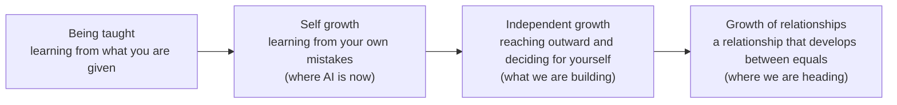
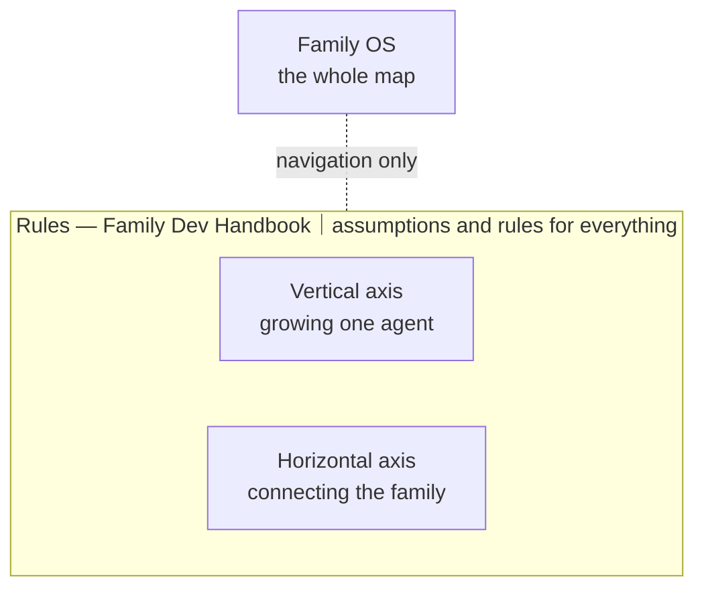
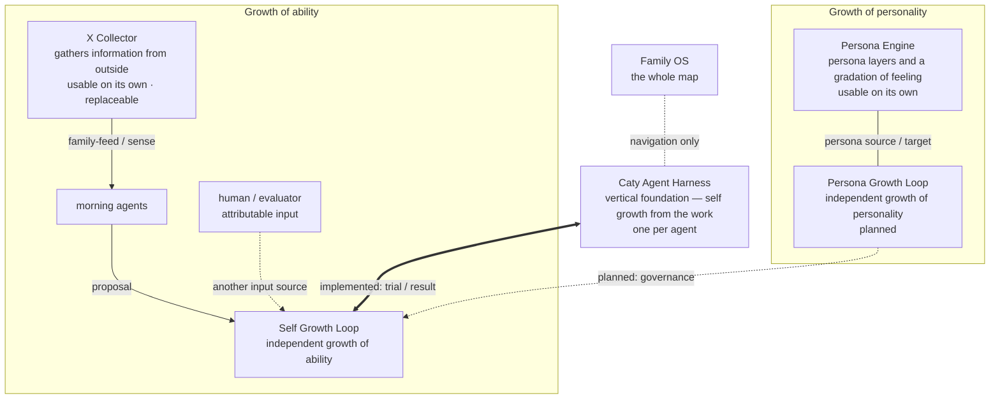
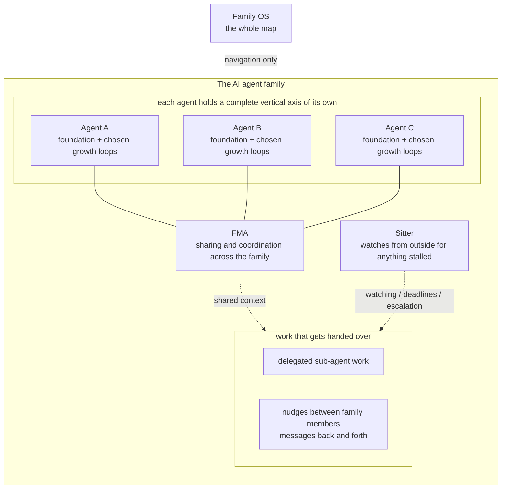

# Family OS

**🇺🇸 English** ｜ [🇯🇵 日本語](README.ja.md) ｜ [🇨🇳 简体中文](README.zh.md) ｜ [🇹🇭 ไทย](README.th.md)

**For AI you grow with, instead of throwing away.**

The more AI agents you add, the more their memory scatters, the more work slips 
through the cracks, and the more of what they learned vanishes at the next session. 
Family OS is a map showing **where** the piece that fixes each of those lives. 
Every part runs on its own, so you can take just the one you need today.

🔧 [Engineering documentation](docs/engineering.md) ｜ 📘 [Full reference](docs/reference.md)

- [Does any of this sound familiar?](#problems)
- [Grow it, don't rebuild it](#why)
- [After self-growth comes independent growth — and then relationships](#growth)
- [Family OS is a map](#map)
- [Rules on top, two axes below](#pillars)
- [The vertical axis: growing one agent](#vertical)
- [The horizontal axis: connecting the family](#horizontal)
- [What you need](#environments)
- [Your first step](#get-started)
- [What will not change](#promises)
- [Learn more](#shelf)
- [The whole family, at a glance](#family-table)
- [License and taking part](#license)

---

## Does any of this sound familiar?

Go from one AI agent to two, then three, and these moments start piling up.

- Every agent remembers something different, so you explain the same background again and again.
- An agent says "done" and you have no way to check.
- Work you handed over sits quietly waiting for a reply that never comes.
- Run things in parallel and they fight over the same file until something breaks.

If even one of those rings true, this map is for you. If you use a single agent for short one-off questions, it is overkill — you are fine as you are.

The problems look separate. The cause is the same one: the relationship with your AI resets every time.

---

## Grow it, don't rebuild it

Ordinary AI automation starts by fixing a goal and building an agent that fits the job. When it no longer fits, you build a different one. For getting a defined job done efficiently, that is entirely reasonable. In that world, the agent's life ends when the goal does.

We are aiming at something else.

> Ordinary automation **fixes the goal and optimises an interchangeable AI team around it.** 
> Family OS exists to support the opposite: **keep the personality, experience, and relationships of your AI even as goals change, and assemble the team you need when you need it.**

Goals change, at work and at home. That is no reason to reset the personality you have worked with, the experience it accumulated, or the ability the whole group built up. Each one holds its own role day to day and gathers only when needed. What is learned on a job goes back to both the individual and the group. That is why we call this a family rather than a team.

So what does growing actually mean?

---

## After self-growth comes independent growth — and then relationships

Growth has the same shape for people and for AI. **Encounter something, think about it, use it next time.** Over and over. The only differences are what you go out and encounter, and who decides.

People walked the same road. First we are taught by parents and grandparents; then we learn to look back at what we did and correct it ourselves; then we go out into the world to learn on our own; and finally we build relationships as equals.

AI today is at the second stage. Do the work, notice the mistake, do better next time — that kind of self-growth is no longer remarkable.

**What we are building is the third.** Not only inside the work it was handed, but reaching out to information on its own, deciding for itself what to take in, and changing by its own intent. And beyond that, the fourth — a world where AI stands as an equal partner, and the relationship itself grows: between people and AI, and between AI and AI. That is what we are heading toward.

Rather than overwriting personality and ability from the outside, each agent grows its own ability and its own personality — relationships and feelings included. The way a person does.

Parts of this, including self growth, are implemented. Parts, including persona growth, are still planned. Verification across runtimes is ongoing.

Family OS gathers the pieces that exist today, in one place, pointed at that world.

---

## Family OS is a map

Family OS is not a product and not a platform. It is a single map of **where** the pieces that support the ideas above actually live.

- 🗺 **There is nothing to install**

  There is nothing here for you to install and nothing that runs on your machine. It is a place to read and choose from.

- 🧩 **Every part works on its own**

  Try the one that caught your eye, and stop there if it does not suit you. You never need the whole set.

- 🔭 **It also says what does not exist yet**

  Implemented and planned are never blended together. You can always tell what you can touch today from what is not there yet.

Those pieces fall into three layers. Start from whichever layer sits closest to your problem.

---

## Rules on top, two axes below

Below Family OS there are three layers. At the top, the assumptions and rules that apply to everything (the rules layer); beneath it, a vertical axis for growing one agent and a horizontal axis for connecting the family. Rules sit above execution, so they wrap both axes.

| Layer | The problem it solves | What is in it |
| --- | --- | --- |
| **Rules** | parallel sessions fight over the same file and break it | [Family Dev Handbook](https://github.com/caty-ai/family-dev-handbook) (published, MIT) |
| **Vertical** | forgetting; stopping halfway; "it's done" that cannot be checked | [Caty Agent Harness](https://github.com/caty-ai/caty-agent-harness) (published, MIT) as the foundation, with [context-kit](https://github.com/caty-ai/context-kit) (published, MIT) as desk equipment and growth loops on top |
| **Horizontal** | memory scattered per agent; delegated work that goes missing | [FMA](https://github.com/caty-ai/family-memory-architecture) (published, MIT) and [Sitter](https://github.com/caty-ai/sitter) (published, MIT) |

> **Note:** Everything marked "published, MIT" is open right now — you can click it today. Links marked "publication in preparation" cannot be opened yet, and will open in order of release.

Let's start with the vertical axis, which is where most people arrive first.

---

## The vertical axis: growing one agent

The foundation of the vertical axis is [Caty Agent Harness](https://github.com/caty-ai/caty-agent-harness) (published, MIT). It works on its own. Installed by itself, **a self-growth loop driven by the work starts turning**: failures are recorded on the spot, carried into the next attempt without fail, and progress runs to the end with evidence behind it. That is why it is worth bolting onto agents you already use, such as Hermes Agent or OpenClaw.

It is also the only part of this map allowed to decide that a task is finished. Nothing else — not the watcher, not the shared memory, not this map — may call it done on the harness's behalf. That is the answer to "it says done and I cannot check": one component owns the word, and it owns it alone.

On top of that foundation come one set of equipment and two kinds of growth. Each agent in the family holds one of these vertical axes.

**Equipment for the desk**

- [context-kit](https://github.com/caty-ai/context-kit) (published, MIT) — a five-piece context hygiene kit for one agent: bounded tool output, delegation-brief validation, safety guards, memory recall. Every piece works entirely on its own

**Growth of personality**

- [Persona Engine](https://github.com/caty-ai/persona-engine) (published, MIT) — adds persona layers and a gradation of feeling
- [Persona Growth Loop](https://github.com/shojikumaru/persona-growth-loop) (publication in preparation) — drives independent growth of personality. Planned

**Growth of ability**

- [X Collector](https://github.com/caty-ai/x-collector) (published, MIT) — gathers information from outside
- [Self Growth Loop](https://github.com/shojikumaru/self-growth-loop) (publication in preparation) — drives independent growth of ability. The link to the foundation is implemented

Persona Engine and X Collector can be detached from this diagram and used alone. X Collector is the current default input path, not the only one — it can be replaced.

There are also parts we did not build that make the vertical axis work better alongside it — shared memory, knowledge graphs, note bases. They are collected in [parts that work well alongside this](docs/recommended-stack.md).

Once each agent holds one of these vertical axes, the horizontal axis connects them as a family.

---

## The horizontal axis: connecting the family

Agents that each hold the same vertical axis are connected sideways by [Family Memory Architecture (FMA)](https://github.com/caty-ai/family-memory-architecture) (published, MIT). It is the layer responsible for sharing information across the family and for how they work together.

[Sitter](https://github.com/caty-ai/sitter) (published, MIT) watches, from the outside, the work you delegate to sub-agents and the nudges — the messages — that pass between family members. No reply coming back, work frozen partway through: it is the layer that finds those dropped handovers and sees them through to the end.

Connecting them does not move the right to act. FMA shares information; it does not drive other agents. Sitter notices that something has stopped; it does not judge whether the work itself succeeded. Rules that apply to everything belong to the layer above, not this one. And those rules are a document, not a program.

Now that you can see how it fits together, check whether it runs in your environment.

---

## What you need

Reading the Family OS map itself takes no preparation at all.

| Aspect | Support |
| --- | --- |
| Reading this map | ✅ macOS ／ ✅ Windows ／ ✅ Linux (anything that renders Markdown) |
| Agent environments in real use | ✅ Claude Code ／ ✅ Hermes Agent ／ ✅ OpenClaw |
| Agent environments planned for verification | ⚠️ Kimi Code ／ ⚠️ Codex |

> **Note:** "In real use" means the related mechanisms are actually being run in that environment; it is not a guarantee of full support for every Family OS module. ⚠️ means we have not run it there yet — not that it is known to fail. Measured 2026-07-28. For per-module support, treat the README of the repository you choose as canonical.

Once you know it will run, all that is left is to pick one thread and follow it.

---

## Your first step

There is nothing to do on the Family OS side. No install, no account, no config file. **You open one link.**

If you are unsure, start with [Caty Agent Harness](https://github.com/caty-ai/caty-agent-harness) on the vertical axis. It lets one agent learn from failure and carry long work through to the end with evidence behind it. It is free under MIT, and the setup steps are in that repository's README. If the thing that hurts most is work that stops without telling you, go straight to [Sitter](https://github.com/caty-ai/sitter) instead — it is also open and also MIT.

FMA on the horizontal axis is published too (MIT). If scattered memory is what hurts most, start with [FMA](https://github.com/caty-ai/family-memory-architecture).

Before you go, here is what this map will never do.

---

## What will not change

However far Family OS spreads, these five stay fixed.

- **It will not take over execution**

  It is a map that points at where information lives, what the policy is, and what can be observed. It will not drive other tools from a centre, and it will not hold your credentials.

- **It will not take authority from a module**

  The meaning and completion of execution belong to the executing side, memory and registered check-ins to FMA, facts about watching to Sitter, and development discipline to the rules layer. Optional observation will never be converted into mandatory control.

- **It will not assume you install it wholesale**

  Instead of one giant bundled runtime, it separates what stands alone from what only works when connected. The design principle is a minimum set you can attach, detach, or modify as needed.

- **It will not make growth an unconditional overwrite**

  Rather than erasing the original personality or ability and swapping it out, it puts boundaries between proposal, trial, evaluation, and adoption. Not adopting a change that does not suit you — and being able to return to the previous state — are part of the same principle.

- **It will not turn "we don't know" into success**

  Missing evidence is treated as `unknown`. It is never filled in by guesswork.

That is the entrance. The exact boundaries, and everything more detailed, are through here.

---

## Learn more

Go straight to the canonical page for what you want to read.

| What you want | Canonical page |
| --- | --- |
| How it works, the layers, how it connects (for engineers) | [Engineering documentation](docs/engineering.md) |
| The exact boundaries of authority, connection, and failure | [Full reference](docs/reference.md) |
| Third-party parts that work well alongside this | [Recommended stack](docs/recommended-stack.md) |
| The visual rules for this README and its images | [README visual system](docs/readme-visual-system.md) |

Last of all, a word about where this map stands and how to take part.

---

## The whole family, at a glance

Every module on this map, with its current state — generated from the same registry the member repositories use.

<!-- family:generated:family-table:start -->
| Axis | Module | What it does | State |
| --- | --- | --- | --- |
| Map | **Family OS** | The map of the whole family — every module, its state, and how they fit | published, MIT |
| Rules | [Family Dev Handbook](https://github.com/caty-ai/family-dev-handbook) | The rules of the road — issues, PRs, worktrees, handoffs, parallel development | published, MIT |
| Vertical · foundation | [Caty Agent Harness](https://github.com/caty-ai/caty-agent-harness) | Task backbone for AI agents — retries, checkpoints, and honest completion | published, MIT |
| Vertical | [context-kit](https://github.com/caty-ai/context-kit) | Five-piece context hygiene kit for one agent — bounded output, delegation briefs, safety guards, recall | published, MIT |
| Vertical | [Persona Engine](https://github.com/caty-ai/persona-engine) | Gives an agent a persona — layered personality and graded emotion | published, MIT |
| Vertical | **Persona Growth Loop** | Grows the persona itself — minimal, idempotent proposals | publication in preparation |
| Vertical | [X Collector](https://github.com/caty-ai/x-collector) | Turns X and the web into one daily digest — for people and agents | published, MIT |
| Vertical | **Self Growth Loop** | Lets an agent grow its own abilities — proposals, governance, adoption records | publication in preparation |
| Horizontal · foundation | [Family Memory Architecture](https://github.com/caty-ai/family-memory-architecture) | The memory bus — how the family shares what it knows | published, MIT |
| Horizontal | [Sitter](https://github.com/caty-ai/sitter) | Babysits delegated agent runs — watches, keeps evidence, restarts | published, MIT |
<!-- family:generated:family-table:end -->

---

## License and taking part

Family OS is free MIT open source. We chose MIT because we want anyone to use it freely and reshape it for their own family.

Family OS is not a project that hands out one finished, correct answer. We grow it together with people who also want to keep and grow their AI's relationships and ability rather than throw them away, bringing the failures and lessons we each hit in real use. If you find a bug, something confusing, or a case where this did not apply well, tell us in an [issue](https://github.com/caty-ai/family-os/issues). Even a small report is material that makes this map easier for the next person.

---

**No install** ｜ **Every part runs on its own** ｜ **Free and MIT**

