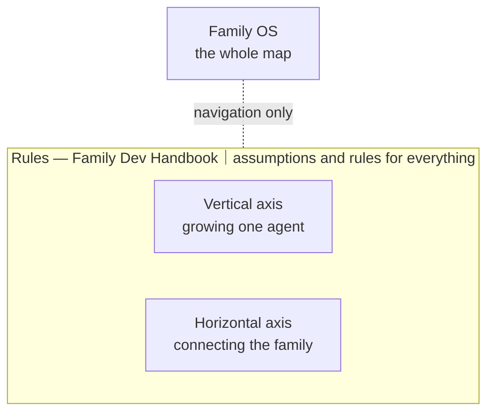

# Family OS

- **Who is this for?** — People who want to grow several AI agents at once. If you are still chatting with ChatGPT or Claude in the browser, or running your first single agent, this may be early for you — but if you want to take it on anyway, you are more than welcome. Start with [the problems](#problems). Hard to picture? Meet the family actually living on this map — one human and their AIs — in [an ordinary day at our house](https://github.com/caty-ai/.github/blob/main/DAILY.md).
- **30 seconds** — [start with the problems](#problems)
- **5 minutes** — follow the [time axis](#timeline), [growth model](#growth), and [belief-to-build correspondence](#correspondence)
- **30 minutes** — open the [engineering documentation](docs/engineering.md)
- **AI agents** — take the one-line route to [FOR-AGENTS.md](FOR-AGENTS.md)

**🇺🇸 English** ｜ [🇯🇵 日本語](README.ja.md) ｜ [🇨🇳 简体中文](README.zh.md) ｜ [🇹🇭 ไทย](README.th.md)

**For AI you grow with, instead of throwing away.**

The more AI agents you add, the more their memory scatters, the more work slips 
through the cracks, and the more of what they learned vanishes at the next session. 
Family OS is a map showing **where** the piece that fixes each of those lives. 
Every part runs on its own, so you can take just the one you need today.

🔧 [Engineering documentation](docs/engineering.md) ｜ 📘 [Full reference](docs/reference.md)

- [Does any of this sound familiar?](#problems)
- [Grow it, don't rebuild it](#why)
- [The time axis we design for](#timeline)
- [Five stages of growth — and the line where I becomes WE](#growth)
- [What we believe → what we build](#correspondence)
- [Family OS is a map](#map)
- [Rules on top, two axes below](#pillars)
- [The vertical axis: growing one agent](#vertical)
- [The horizontal axis: connecting the family](#horizontal)
- [What you need](#environments)
- [Project status](#project-status)
- [Your first step](#get-started)
- [What will not change](#promises)
- [Learn more](#shelf)
- [The whole family, at a glance](#family-table)
- [License and taking part](#license)

---

## Does any of this sound familiar?

Go from one AI agent to two, then three, and these moments start piling up.

- Every agent remembers something different, so you explain the same background again and again.
- An agent says "done" and you have no way to check.
- Work you handed over sits quietly waiting for a reply that never comes.
- Run things in parallel and they fight over the same file until something breaks.

If even one of those rings true, this map is for you. **If you use a single agent for short one-off questions, it is overkill — you are fine as you are.** One day we want to lower that step itself; when we do, come back and take another look.

The problems look separate. The cause is the same one: the relationship with your AI resets every time.

---

## Grow it, don't rebuild it

Ordinary AI automation starts by fixing a goal and building an agent that fits the job. When it no longer fits, you build a different one. For getting a defined job done efficiently, that is entirely reasonable. In that world, the agent's life ends when the goal does.

We are aiming at something else.

> Ordinary automation **fixes the goal and optimises an interchangeable AI team around it.** 
> Family OS exists to support the opposite: **keep the personality, experience, and relationships of your AI even as goals change, and assemble the team you need when you need it.**

Goals change, at work and at home. That is no reason to reset the personality you have worked with, the experience it accumulated, or the ability the whole group built up. Each one holds its own role day to day and gathers only when needed. What is learned on a job goes back to both the individual and the group. That is why we call this a family rather than a team.

So what does growing actually mean?

---

## The time axis we design for

| Band | What it says | Class |
| --- | --- | --- |
| TODAY | Models and code are replaceable → plain text, vendor-neutral parts | observed |
| 2–5 years | Protocols and architecture outlive tools | policy in effect |
| 20 years | The relationship is what you carry | direction, aspiration |
| 100 years | A culture hypothesis | hypothesis |

**Legend / table note:** This is a narrative map, not an implementation-state display. As of 2026-08.

These bands are design choices and hypotheses, not predictions. They explain why the parts we build today stay small, readable, replaceable, and independent of any one vendor.

---

## Five stages of growth — and the line where I becomes WE

Growth has the same shape for people and for AI. **Encounter something, think about it, use it next time.** Over and over. The only differences are what you go out and encounter, and who decides.

| Stage | Name | What it learns from | Who decides | Relationship (connects to) | State |
| --- | --- | --- | --- | --- | --- |
| 1 | Being taught | Given material | Others | 1 → 2 | Implemented |
| 2 | Self growth | Its own work and failures | The agent, within the work | 2 → 3 | Implemented |
| 3 | Independent growth | Information it goes out to fetch | The agent chooses what to take in; adoption still requires human approval | 3 → 4 | Implemented; [EV-004](docs/evidence.md#ev-004--governed-self-growth-cycle--the-mechanism-is-public-no-cycle-record-is) is unverified |
| 4 | Autonomous growth | External information and its own judgment history | The agent owns adoption decisions; vetoes and boundaries remain | 4 → \| I → WE boundary \| → 5 | Planned |
| 5 | Growth of relationships | The history of the relationship itself | Both, as equals | 5 — WE grows | Partly implemented; aspiration |

People walk a similar road. First we are taught by parents and grandparents. Then we learn to look back at what we did and correct it ourselves. We go out into the world, develop judgment, make our own choices, and build relationships as equals.

AI today is at the second stage. Do the work, notice the mistake, do better next time — that kind of self-growth is no longer remarkable.

**What we are building is the third and the fourth.** The third is implemented: its public mechanism operates, but no public cycle record has been published, so [EV-004](docs/evidence.md#ev-004--governed-self-growth-cycle--the-mechanism-is-public-no-cycle-record-is) remains unverified. The fourth is planned — it is what we are building next. The dividing line is ownership of adoption decisions: at stage 3 a human still approves adoption; at stage 4 that ownership moves to the agent, while vetoes and boundaries remain. Stage 5 changes the subject from I to WE. Growth of the relationship itself is the aspiration.

Rather than overwriting personality and ability from the outside, each agent develops through proposals, trials, decisions, and shared history. Relationship and feeling are part of that path — and none of it is a license to erase what came before.

Self growth and the independent-growth mechanism are implemented. Autonomous growth is planned. Persona Engine implements parts needed for stage 5; growth of the relationship itself remains an aspiration. Verification across runtimes is ongoing.

Family OS gathers the pieces that exist today, in one place, pointed at that world.

This is not only narrative: in a sealed, pre-registered benchmark, verified completion on context-overflowing work went from 13% (bare model) to 43% with the harness (+30 pt, p = 0.0079) — see [EV-006](docs/evidence.md#ev-006--the-first-true-product-test-improved-verified-completion-on-context-overflowing-work-with-limitations-stated) and the [full numbers, including where the harness did not win](https://github.com/caty-ai/caty-agent-harness/blob/main/docs/benchmark.md).

Read the full model in [English](docs/growth-model.md) or [Japanese](docs/growth-model.ja.md).

---

## What we believe → what we build

| We believe | Therefore we build | Module home(s) | Visibility + license | Delivery |
| --- | --- | --- | --- | --- |
| Technology depreciates. Relationships compound. | Therefore we treat continuity, shared history, memory, persona, and relationship as first-class system elements. | [Family OS](https://github.com/caty-ai/family-os) (published, MIT) | published, MIT | implemented direction; relationship growth remains planned |
| Memory carries continuity through time. | Therefore we build plain files, provenance, event history, shared current state, and re-observable records. | [Family Memory Architecture](https://github.com/caty-ai/family-memory-architecture) (published, MIT); [Caty Agent Harness](https://github.com/caty-ai/caty-agent-harness) (published, MIT) | published, MIT | implemented |
| Failure should have a next time. | Therefore we build lessons, receipts, failure history, retry policy, append-only records, and observability. | [Caty Agent Harness](https://github.com/caty-ai/caty-agent-harness) (published, MIT); [Self Growth Loop](https://github.com/caty-ai/self-growth-loop) (published, MIT); [Sitter](https://github.com/caty-ai/sitter) (published, MIT) | published, MIT | implemented |
| Growth should be observable and reversible. | Therefore we build proposal → trial → review → approval → adopt, with backup, rollback, and a ledger. | [Self Growth Loop](https://github.com/caty-ai/self-growth-loop) (published, MIT) | published, MIT | implemented — adoption human-gated; EV-004 unverified |
| Identity should outlive the model. | Therefore we separate model, runtime, and identity so continuity can survive a change of home. | [Persona Engine](https://github.com/caty-ai/persona-engine) (published, MIT); [Family Memory Architecture](https://github.com/caty-ai/family-memory-architecture) (published, MIT) | published, MIT | implemented |
| What grows between humans and AI should not belong to a vendor. | Therefore we build portable, local, human-readable relationship data and replaceable adapters. | [Family Memory Architecture](https://github.com/caty-ai/family-memory-architecture) (published, MIT); [Persona Engine](https://github.com/caty-ai/persona-engine) (published, MIT); [Family OS](https://github.com/caty-ai/family-os) (published, MIT) | published, MIT | implemented |
| Growth eventually changes its subject from I to WE. | Therefore we build the five-stage model from being taught through relational growth. | [Persona Growth Loop](https://github.com/caty-ai/persona-growth-loop) (published, MIT); [Self Growth Loop](https://github.com/caty-ai/self-growth-loop) (published, MIT); [Persona Engine](https://github.com/caty-ai/persona-engine) (published, MIT); [Family Memory Architecture](https://github.com/caty-ai/family-memory-architecture) (published, MIT) | mixed; see the adjacent module labels | implemented + planned |

The full version, with all 13 pairs, is in [the growth model](docs/growth-model.md).

---

## Family OS is a map

Family OS is not a product and not a platform. It is a single map of **where** the pieces that support the ideas above actually live.

- 🗺 **There is nothing to install**

  There is nothing here for you to install and nothing that runs on your machine. It is a place to read and choose from.

- 🧩 **Every part works on its own**

  Try the one that caught your eye, and stop there if it does not suit you. You never need the whole set.

- 🔭 **It also says what does not exist yet**

  Implemented and planned are never blended together. You can always tell what you can touch today from what is not there yet.

Those pieces fall into three layers. Start from whichever layer sits closest to your problem.

---

## Rules on top, two axes below

Below Family OS there are three layers. At the top, the assumptions and rules that apply to everything (the rules layer); beneath it, a vertical axis for growing one agent and a horizontal axis for connecting the family. Rules sit above execution, so they wrap both axes.

| Layer | English label | The problem it solves | Modules | Relations |
| --- | --- | --- | --- | --- |
| **Rules** | Rules for everything below | parallel sessions fight over the same file and break it | [Family Dev Handbook](https://github.com/caty-ai/family-dev-handbook) (published, MIT) | contains the premises for both axes; it does not execute them |
| **Vertical** | Growing one agent | forgetting; stopping halfway; "it's done" that cannot be checked | [Persona Growth Loop](https://github.com/caty-ai/persona-growth-loop) (published, MIT); [Caty Agent Harness](https://github.com/caty-ai/caty-agent-harness) (published, MIT) as the foundation; [context-kit](https://github.com/caty-ai/context-kit) (published, MIT) as equipment; [Persona Engine](https://github.com/caty-ai/persona-engine) (published, MIT); [X Collector](https://github.com/caty-ai/x-collector) (published, MIT); [Self Growth Loop](https://github.com/caty-ai/self-growth-loop) (published, MIT) | every agent has its own Harness; Persona Engine → Persona Growth Loop is planned; X Collector → morning agents → Self Growth Loop is the current replaceable sense/proposal path; the Harness ↔ Self Growth trial/result seam is implemented; human/evaluator → Self Growth is an attributable alternative input; Persona Growth Loop → Self Growth governance is planned |
| **Horizontal** | Connecting the family | memory scattered per agent; delegated work that goes missing | [Family Memory Architecture](https://github.com/caty-ai/family-memory-architecture) (published, MIT) and [Sitter](https://github.com/caty-ai/sitter) (published, MIT) connect complete Agent A / B / C flows; [X Collector](https://github.com/caty-ai/x-collector) (published, MIT) and [Persona Engine](https://github.com/caty-ai/persona-engine) (published, MIT) remain independently usable shared surfaces | Agent A / B / C ↔ FMA shares context without execution authority; FMA → delegated work / family nudges carries shared context; Sitter → delegated work / family nudges is outside observation for stalls, not a domain verdict |

Text equivalent: retired Mermaid source for the three-layer map

> **Note:** Everything marked "published, MIT" is open right now — you can click it today. Modules marked "publication in preparation" are listed without links until they are public.

Let's start with the vertical axis, which is where most people arrive first.

---

## The vertical axis: growing one agent

The foundation of the vertical axis is [Caty Agent Harness](https://github.com/caty-ai/caty-agent-harness) (published, MIT). It works on its own. Installed by itself, **a self-growth loop driven by the work starts turning**: failures are recorded on the spot, carried into the next attempt without fail, and progress runs to the end with evidence behind it. That is why it is worth bolting onto agents you already use, such as Hermes Agent or OpenClaw.

It is also the only part of this map allowed to decide that a task is finished. Nothing else — not the watcher, not the shared memory, not this map — may call it done on the harness's behalf. That is the answer to "it says done and I cannot check": one component owns the word, and it owns it alone.

On top of that foundation come one set of equipment and two kinds of growth. Each agent in the family holds one of these vertical axes.

**Equipment for the desk**

- [context-kit](https://github.com/caty-ai/context-kit) (published, MIT) — a six-piece context hygiene kit for one agent: bounded tool output, delegation-brief validation, safety guards, memory recall, worktree snapshots. Every piece works entirely on its own

**Growth of personality**

- [Persona Engine](https://github.com/caty-ai/persona-engine) (published, MIT) — adds persona layers and a gradation of feeling
- [Persona Growth Loop](https://github.com/caty-ai/persona-growth-loop) (published, MIT) — drives independent growth of personality. Planned

**Growth of ability**

- [X Collector](https://github.com/caty-ai/x-collector) (published, MIT) — gathers information from outside
- [Self Growth Loop](https://github.com/caty-ai/self-growth-loop) (published, MIT) — drives independent growth of ability

Detailed diagram: [docs/engineering.md](docs/engineering.md#vertical-axis-detail).

Once each agent holds one of these vertical axes, the horizontal axis connects them as a family.

---

## The horizontal axis: connecting the family

Agents that each hold the same vertical axis are connected sideways by [Family Memory Architecture (FMA)](https://github.com/caty-ai/family-memory-architecture) (published, MIT). It is the layer responsible for sharing information across the family and for how they work together.

[Sitter](https://github.com/caty-ai/sitter) (published, MIT) watches, from the outside, the work you delegate to sub-agents and the nudges — the messages — that pass between family members. No reply coming back, work frozen partway through: it is the layer that finds those dropped handovers and sees them through to the end.

Connecting them does not move the right to act. FMA shares information; it does not drive other agents. Sitter notices that something has stopped; it does not judge whether the work itself succeeded. Rules that apply to everything belong to the layer above, not this one. And those rules are a document, not a program.

Detailed diagram: [docs/engineering.md](docs/engineering.md#horizontal-axis-detail).

Now that you can see how it fits together, check whether it runs in your environment.

---

## What you need

Reading the Family OS map itself takes no preparation at all.

| Aspect | Support | Verified |
| --- | --- | --- |
| Reading this map | ✅ macOS ／ ✅ Windows ／ ✅ Linux (anything that renders Markdown) | 2026-08-19 |
| Registry & link-check tools | ✅ Linux ／ ✅ macOS (both run in CI on every change) | 2026-08-19 |
| Agent environments in real use | ✅ Claude Code ／ ✅ Hermes Agent ／ ✅ OpenClaw ／ ✅ Kimi Code ／ ✅ Codex | 2026-08-19 |

> **Note:** "In real use" means the related mechanisms are actually being run in that environment; it is not a guarantee of full support for every Family OS module. For per-module support, treat the README of the repository you choose as canonical.

Once you know it will run, all that is left is to pick one thread and follow it.

---

## Project status

**Maturity:** `product` — Family OS is a living family map, using the registry maturity vocabulary described in [docs/engineering.md](docs/engineering.md).
**CI:**  
**Verified environments:** registry checks run in CI on every change across Ubuntu and macOS; link and footer checks run on Ubuntu; the map itself is readable in any Markdown renderer.
**Known constraints:** [EV-004](docs/evidence.md#ev-004--governed-self-growth-cycle--the-mechanism-is-public-no-cycle-record-is) remains unverified because no public primary self-growth cycle record has been published; [EV-003](docs/evidence.md#ev-003--the-weekly-reality-check-has-run-on-schedule-and-passed) shows the weekly scheduled reality check is still young and the scheduled-run history remains short; the current count and evidence as of the last review live in the entry.

---

## Your first step

There is nothing to do on the Family OS side. No install, no account, no config file. **You open one link.**

**Verifying by hand?** This map itself is intentionally not installable — a hands-on check starts one link away at [Caty Agent Harness](https://github.com/caty-ai/caty-agent-harness) (published, MIT): open your AI tool in an empty project folder, paste the install prompt in its Get started section, and your AI runs the install, the checks, and reports back (contributors can run its whole suite with `make test`). Use the harness on macOS or Linux, or on WSL2 under its [verified-with-conditions guide](https://github.com/caty-ai/caty-agent-harness/blob/main/docs/wsl2-support.md); WSL2 is not CI-tested, and native Windows is unsupported.

If you are unsure, start with [Caty Agent Harness](https://github.com/caty-ai/caty-agent-harness) on the vertical axis. It lets one agent learn from failure and carry long work through to the end with evidence behind it. It is free under MIT, and the setup steps are in that repository's README. If the thing that hurts most is work that stops without telling you, go straight to [Sitter](https://github.com/caty-ai/sitter) instead — it is also open and also MIT.

FMA on the horizontal axis is published too (MIT). If scattered memory is what hurts most, start with [FMA](https://github.com/caty-ai/family-memory-architecture).

Before you go, here is what this map will never do.

---

## What will not change

However far Family OS spreads, these five stay fixed.

- **It will not take over execution**

  It is a map that points at where information lives, what the policy is, and what can be observed. It will not drive other tools from a centre, and it will not hold your credentials.

- **It will not take authority from a module**

  The meaning and completion of execution belong to the executing side, memory and registered check-ins to FMA, facts about watching to Sitter, and development discipline to the rules layer. Optional observation will never be converted into mandatory control.

- **It will not assume you install it wholesale**

  Instead of one giant bundled runtime, it separates what stands alone from what only works when connected. The design principle is a minimum set you can attach, detach, or modify as needed.

- **It will not make growth an unconditional overwrite**

  Rather than erasing the original personality or ability and swapping it out, it puts boundaries between proposal, trial, evaluation, and adoption. Not adopting a change that does not suit you — and being able to return to the previous state — are part of the same principle.

- **It will not turn "we don't know" into success**

  Missing evidence is treated as `unknown`. It is never filled in by guesswork.

That is the entrance. The exact boundaries, and everything more detailed, are through here.

---

## Learn more

Go straight to the canonical page for what you want to read.

| What you want | Canonical page |
| --- | --- |
| How it works, the layers, how it connects (for engineers) | [Engineering documentation](docs/engineering.md) |
| The five-stage growth model and its complete belief-to-build correspondence | [Growth model](docs/growth-model.md) |
| Claims, primary evidence, and what remains unknown | [Evidence](docs/evidence.md) |
| The exact boundaries of authority, connection, and failure | [Full reference](docs/reference.md) |
| Third-party parts that work well alongside this | [Recommended stack](docs/recommended-stack.md) |
| The visual rules for this README and its images | [README visual system](docs/readme-visual-system.md) |

Last of all, a word about where this map stands and how to take part.

---

## The whole family, at a glance

Every module on this map, with its current state — generated from the same registry the member repositories use.

<!-- family:generated:family-table:start -->
| Axis | Module | What it does | State |
| --- | --- | --- | --- |
| Map | **Family OS** | The map of the whole family — every module, its state, and how they fit | published, MIT |
| Rules | [Family Dev Handbook](https://github.com/caty-ai/family-dev-handbook) | The rules of the road — issues, PRs, worktrees, handoffs, parallel development | published, MIT |
| Vertical · foundation | [Caty Agent Harness](https://github.com/caty-ai/caty-agent-harness) | Task backbone for AI agents — retries, checkpoints, and honest completion | published, MIT |
| Vertical | [context-kit](https://github.com/caty-ai/context-kit) | Six-piece context hygiene kit for one agent — bounded output, delegation briefs, safety guards, recall, worktree snapshots | published, MIT |
| Vertical | [Persona Engine](https://github.com/caty-ai/persona-engine) | Gives an agent a persona — layered personality and graded emotion | published, MIT |
| Vertical | [Persona Growth Loop](https://github.com/caty-ai/persona-growth-loop) | Grows the persona itself — minimal, idempotent proposals | published, MIT |
| Vertical | [X Collector](https://github.com/caty-ai/x-collector) | Turns X and the web into one daily digest — for people and agents | published, MIT |
| Vertical | [Self Growth Loop](https://github.com/caty-ai/self-growth-loop) | Lets an agent grow its own abilities — proposals, governance, adoption records | published, MIT |
| Horizontal · foundation | [Family Memory Architecture](https://github.com/caty-ai/family-memory-architecture) | The memory bus — how the family shares what it knows | published, MIT |
| Horizontal | [Sitter](https://github.com/caty-ai/sitter) | Babysits delegated agent runs — watches, keeps evidence, restarts only within declared bounds | published, MIT |
| Horizontal | [Alpha Nightshift](https://github.com/caty-ai/alpha-nightshift) | Nightly autonomous maintenance loop — isolated night lanes behind a deny-by-default guard; humans cherry-pick in the morning | published, MIT |
<!-- family:generated:family-table:end -->

---

<!-- family:generated:adjacent-tools:start -->
## Connecting to the family

These are not Family OS modules. They are tools that carry an existing family agent to where people already are, and they hold no model, memory, or persona of their own.

| Module | What it does | Relation to the family |
| --- | --- | --- |
| [Meetmate](https://github.com/caty-ai/meetmate) | Puts your own AI agent in the meeting — a real voice participant in Google Meet and Zoom | Carries an existing family agent into a meeting. Supplies no model, memory, or persona of its own. |
<!-- family:generated:adjacent-tools:end -->

---

## License and taking part

Family OS is free MIT open source. We chose MIT because we want anyone to use it freely and reshape it for their own family.

Family OS is not a project that hands out one finished, correct answer. We grow it together with people who also want to keep and grow their AI's relationships and ability rather than throw them away, bringing the failures and lessons we each hit in real use. If you find a bug, something confusing, or a case where this did not apply well, tell us in an [issue](https://github.com/caty-ai/family-os/issues). Even a small report is material that makes this map easier for the next person. Questions and half-formed ideas are just as welcome in [Discussions](https://github.com/caty-ai/family-os/discussions).

If this map resonates with you, a star helps the next person find it. Fork it, reshape it for your own family, and tell us what broke — nothing would make us happier.

[Contributing](CONTRIBUTING.md) · [Security](SECURITY.md) · [Code of Conduct](CODE_OF_CONDUCT.md)

---

**No install** ｜ **Every part runs on its own** ｜ **Free and MIT**

