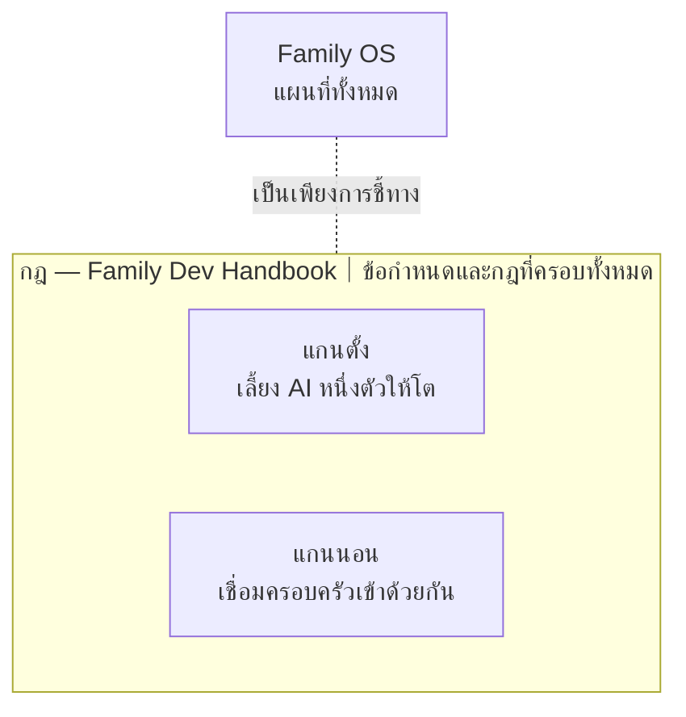
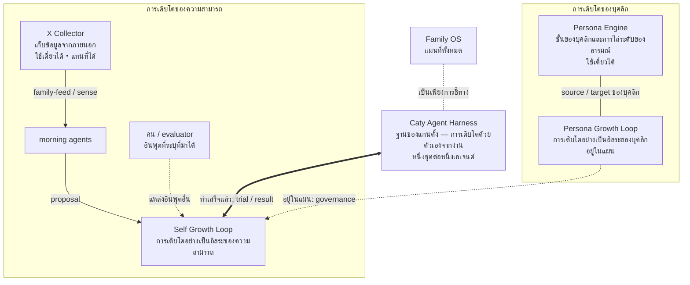
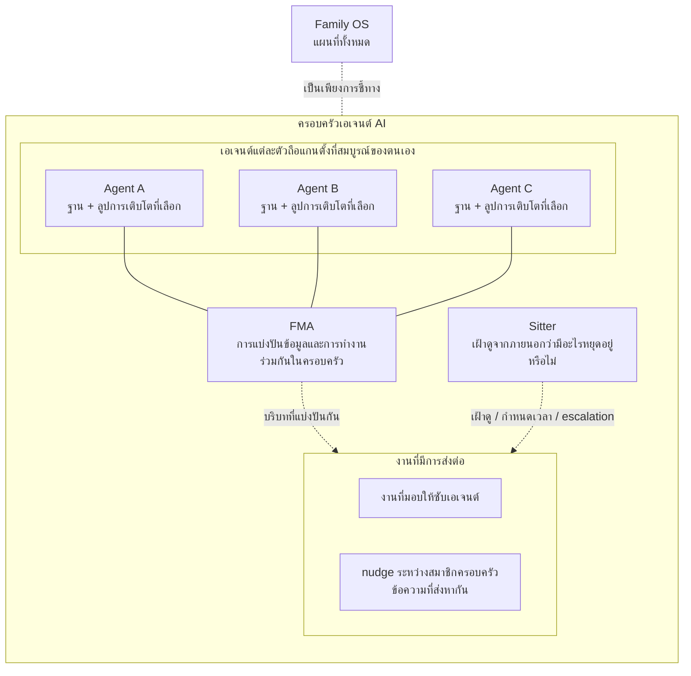

# Family OS

[🇺🇸 English](README.md) ｜ [🇯🇵 日本語](README.ja.md) ｜ [🇨🇳 简体中文](README.zh.md) ｜ **🇹🇭 ไทย**

**เพื่อ AI ที่เติบโตไปกับคุณ ไม่ใช่ใช้แล้วทิ้ง**

ยิ่งเพิ่มเอเจนต์ AI มากเท่าไร ความทรงจำก็ยิ่งกระจัดกระจาย งานยิ่งหล่นหาย 
และประสบการณ์ที่อุตส่าห์สั่งสมมาก็หายไปในเซสชันถัดไป 
Family OS คือแผนที่ที่บอกว่ากลไกซึ่งแก้ปัญหาแต่ละข้อนั้น**อยู่ตรงไหน** 
ทุกชิ้นส่วนทำงานได้ด้วยตัวเอง คุณจึงหยิบไปแค่ชิ้นที่ต้องการวันนี้ได้

🔧 [เอกสารสำหรับวิศวกร](docs/engineering.md) (ภาษาอังกฤษ) ｜ 📘 [ข้อกำหนดฉบับเต็ม](docs/reference.md) (ภาษาอังกฤษ)

- [คุณเคยเจอเรื่องแบบนี้ไหม](#problems)
- [ไม่ใช่สร้างใหม่ แต่คือเลี้ยงให้โต](#why)
- [การเติบโตห้าขั้น — และเส้นที่ “ฉัน” เปลี่ยนเป็น “เรา”](#growth)
- [Family OS คือแผนที่](#map)
- [กฎอยู่ด้านบน แกนตั้งและแกนนอนอยู่ด้านล่าง](#pillars)
- [แกนตั้ง: เลี้ยง AI หนึ่งตัวให้โต](#vertical)
- [แกนนอน: เชื่อมครอบครัวเข้าด้วยกัน](#horizontal)
- [สิ่งที่ต้องมี](#environments)
- [ก้าวแรก](#get-started)
- [สัญญาที่จะไม่เปลี่ยน](#promises)
- [อ่านเพิ่มเติม](#shelf)
- [ทั้งครอบครัวในหน้าเดียว](#family-table)
- [สัญญาอนุญาตและการมีส่วนร่วม](#license)

---

## คุณเคยเจอเรื่องแบบนี้ไหม

เมื่อเพิ่มเอเจนต์ AI จากหนึ่งตัวเป็นสอง เป็นสาม สถานการณ์แบบนี้จะเกิดถี่ขึ้นเรื่อย ๆ

- แต่ละตัวจำคนละอย่าง คุณจึงต้องอธิบายภูมิหลังเดิมซ้ำแล้วซ้ำอีก
- มันบอกว่า "ทำเสร็จแล้ว" แต่คุณไม่มีทางตรวจสอบได้
- งานที่ส่งต่อไปแล้วค้างเงียบอยู่ตรงนั้น รอคำตอบที่ไม่เคยมา
- พองานหลายอย่างวิ่งพร้อมกัน มันก็แย่งไฟล์เดียวกันจนพัง

ถ้ามีสักข้อที่ตรงกับคุณ แผนที่นี้ทำมาเพื่อคุณ ในทางกลับกัน ถ้าคุณใช้ AI แค่ตัวเดียวกับคำถามสั้น ๆ ครั้งเดียวจบ นี่ถือว่าเกินความจำเป็น — อยู่แบบเดิมก็ดีอยู่แล้ว

ปัญหาเหล่านี้ดูเหมือนคนละเรื่อง แต่มีต้นเหตุเดียวกัน นั่นคือความสัมพันธ์ระหว่างคุณกับ AI ถูกรีเซ็ตทุกครั้ง

---

## ไม่ใช่สร้างใหม่ แต่คือเลี้ยงให้โต

ระบบอัตโนมัติด้วย AI แบบทั่วไปจะกำหนดเป้าหมายก่อน แล้วสร้างเอเจนต์ที่เหมาะกับงานนั้น พอไม่เหมาะแล้วก็สร้างตัวใหม่ ถ้าเป้าหมายคือทำงานที่กำหนดไว้ให้มีประสิทธิภาพ นี่เป็นวิธีที่สมเหตุสมผล ในโลกแบบนั้น เมื่อเป้าหมายจบ หน้าที่ของเอเจนต์ก็จบตามไปด้วย

สิ่งที่เรามุ่งไปนั้นต่างออกไป

> ระบบอัตโนมัติทั่วไป **ตรึงเป้าหมายไว้ แล้วปรับทีม AI ที่เปลี่ยนตัวได้ให้เหมาะกับมัน** 
> สิ่งที่ Family OS อยากรองรับคือด้านตรงข้าม: **แม้เป้าหมายจะเปลี่ยน ก็ยังรักษาบุคลิก ประสบการณ์ และความสัมพันธ์ของ AI เอาไว้ แล้วจัดทีมที่ต้องการขึ้นมาเมื่อถึงเวลา**

เป้าหมายในงานและในชีวิตย่อมเปลี่ยน แต่นั่นไม่ใช่เหตุผลที่จะต้องรีเซ็ตบุคลิกของ AI ที่ทำงานร่วมกันมา ประสบการณ์ที่สั่งสม หรือความสามารถที่ทั้งกลุ่มสร้างขึ้น ปกติต่างคนต่างถือบทบาทของตัวเอง แล้วมารวมกันเฉพาะเมื่อจำเป็น สิ่งที่เรียนรู้จากงานถูกนำกลับไปทั้งที่ตัวบุคคลและที่ส่วนรวม เราจึงเรียกสิ่งนี้ว่า "ครอบครัว" ไม่ใช่ "ทีม"

แล้วการเติบโตหมายถึงอะไรกันแน่

---

## การเติบโตห้าขั้น — และเส้นที่ “ฉัน” เปลี่ยนเป็น “เรา”

รูปแบบของการเติบโตนั้นเหมือนกันทั้งในคนและใน AI **ได้สัมผัสอะไรบางอย่าง คิดกับมัน แล้วใช้มันในครั้งถัดไป** วนแบบนี้ไปเรื่อย ๆ สิ่งที่ต่างกันมีแค่ว่าจะออกไปสัมผัสอะไร และใครเป็นคนตัดสิน

| ขั้น | ชื่อ | เรียนรู้จากอะไร | ใครเป็นผู้ตัดสิน | ความสัมพันธ์ (เชื่อมไปยัง) | สถานะ |
| --- | --- | --- | --- | --- | --- |
| 1 | การถูกสอน | สิ่งที่ได้รับมา | ผู้อื่น | 1 → 2 | นำไปใช้แล้ว |
| 2 | การเติบโตด้วยตัวเอง | งานและความล้มเหลวของตัวเอง | ตัวเอเจนต์ ภายในขอบเขตของงาน | 2 → 3 | นำไปใช้แล้ว |
| 3 | การเติบโตอย่างเป็นอิสระ | ข้อมูลที่ออกไปค้นหาเอง | ตัวเอเจนต์เลือกว่าจะรับอะไร แต่การนำมาใช้ยังต้องได้รับอนุมัติจากมนุษย์ | 3 → 4 | นำไปใช้แล้ว; [EV-004](docs/evidence.md#ev-004--governed-self-growth-cycle--the-mechanism-is-public-no-cycle-record-is) ยังไม่ผ่านการยืนยัน |
| 4 | การเติบโตแบบกำกับตนเอง | ข้อมูลภายนอกและประวัติการตัดสินของตัวเอง | สิทธิ์ตัดสินใจนำมาใช้เป็นของเอเจนต์ โดยยังมีสิทธิ์ยับยั้งและขอบเขต | 4 → \| เส้นแบ่ง ฉัน → เรา \| → 5 | อยู่ในแผน |
| 5 | การเติบโตของความสัมพันธ์ | ประวัติของความสัมพันธ์นั้นเอง | ทั้งสองฝ่ายอย่างเท่าเทียม | 5 — “เรา” เติบโต | นำไปใช้แล้วบางส่วน; สิ่งที่มุ่งหวัง |

มนุษย์ก็เดินบนเส้นทางคล้ายกัน ตอนแรกได้รับการสอนจากพ่อแม่และปู่ย่าตายาย ต่อมาจึงมองย้อนการกระทำของตัวเองและแก้ไขได้ แล้วออกไปสู่โลกเพื่อฝึกการตัดสินใจ เลือกด้วยตัวเอง และสร้างความสัมพันธ์ที่เท่าเทียมกับผู้อื่น

AI ทุกวันนี้อยู่ที่ขั้นที่สอง ทำงาน เห็นข้อผิดพลาด แล้วครั้งหน้าทำได้ดีขึ้น — การเติบโตด้วยตัวเองแบบนี้ไม่ใช่เรื่องพิเศษอีกต่อไป

**สิ่งที่เรากำลังสร้างคือขั้นที่สามและขั้นที่สี่** ขั้นที่สามนำไปใช้แล้ว: กลไกเปิดเผยต่อสาธารณะและกำลังทำงาน แต่ยังไม่มีบันทึกรอบการเติบโตที่เปิดเผย จึงทำให้ [EV-004](docs/evidence.md#ev-004--governed-self-growth-cycle--the-mechanism-is-public-no-cycle-record-is) ยังไม่ผ่านการยืนยัน ขั้นที่สี่ยังอยู่ในแผน — นี่คือสิ่งที่เราจะสร้างต่อไป เส้นแบ่งคือผู้ที่เป็นเจ้าของการตัดสินใจนำสิ่งที่เรียนรู้มาใช้: ขั้นที่สามยังต้องให้มนุษย์อนุมัติ ส่วนขั้นที่สี่จะย้ายสิทธิ์นั้นไปยังเอเจนต์ โดยยังคงสิทธิ์ยับยั้งและขอบเขตไว้ ขั้นที่ห้าเปลี่ยนประธานจาก “ฉัน” เป็น “เรา” การที่ความสัมพันธ์เติบโตได้เองคือสิ่งที่เรามุ่งหวัง

ไม่ใช่การเขียนทับบุคลิกและความสามารถเดิมจากภายนอก แต่คือให้เอเจนต์ AI แต่ละตัวเติบโตผ่านข้อเสนอ การทดลอง การตัดสินใจ และประวัติที่มีร่วมกัน ความสัมพันธ์และความรู้สึกเป็นส่วนหนึ่งของเส้นทางนี้ — และไม่มีส่วนใดในนั้นเป็นใบอนุญาตให้ลบสิ่งที่เคยเป็น

การเติบโตด้วยตัวเองและกลไกการเติบโตอย่างเป็นอิสระนำไปใช้แล้ว การเติบโตแบบกำกับตนเองยังอยู่ในแผน Persona Engine นำบางส่วนที่จำเป็นต่อขั้นที่ห้าไปใช้แล้ว ส่วนการเติบโตของความสัมพันธ์นั้นเองยังเป็นสิ่งที่มุ่งหวัง การตรวจสอบสภาพแวดล้อมการทำงานก็กำลังทยอยดำเนินการ

เพื่อมุ่งไปสู่โลกใบนั้น Family OS จึงรวบรวมกลไกที่มีอยู่จริงในตอนนี้ไว้ที่เดียวกัน

รายละเอียดฉบับเต็มมีให้อ่านเป็น[ภาษาอังกฤษ](docs/growth-model.md)และ[ภาษาญี่ปุ่น](docs/growth-model.ja.md)

---

## Family OS คือแผนที่

Family OS ไม่ใช่ผลิตภัณฑ์และไม่ใช่แพลตฟอร์ม มันคือแผนที่หนึ่งใบที่บอกว่ากลไกซึ่งรองรับแนวคิดข้างต้นนั้น**อยู่ตรงไหน**

- 🗺 **ไม่มีอะไรต้องติดตั้ง**

  ที่นี่ไม่มีอะไรให้คุณติดตั้ง และไม่มีอะไรทำงานบนเครื่องของคุณ มันเป็นเพียงที่ให้อ่านแล้วเลือกหยิบ

- 🧩 **ทุกชิ้นส่วนทำงานได้ด้วยตัวเอง**

  ลองเฉพาะชิ้นที่สนใจ ถ้าไม่เข้ากันก็จบตรงนั้นได้ ไม่จำเป็นต้องมีครบทุกชิ้น

- 🔭 **สิ่งที่ยังทำไม่ได้ก็เขียนไว้ด้วย**

  เราไม่ปนสิ่งที่ทำเสร็จแล้วกับสิ่งที่ยังอยู่ในแผน สิ่งที่แตะได้ตอนนี้กับสิ่งที่ยังไม่มี แยกออกจากกันชัดเจน

กลไกเหล่านี้แบ่งเป็นสามชั้น เลือกจากชั้นที่ใกล้กับปัญหาของคุณที่สุด

---

## กฎอยู่ด้านบน แกนตั้งและแกนนอนอยู่ด้านล่าง

ใต้ Family OS แบ่งเป็นสามชั้น บนสุดคือข้อกำหนดและกฎที่ครอบทั้งหมด (กฎ) ถัดลงมาคือแกนตั้งสำหรับเลี้ยง AI หนึ่งตัว และแกนนอนสำหรับเชื่อมครอบครัว กฎมีลำดับสูงกว่าการทำงานจริง จึงอยู่ในตำแหน่งที่โอบทั้งสองแกนไว้

| ชั้น | ปัญหาที่แก้ได้ | เนื้อหา |
| --- | --- | --- |
| **กฎ** | หลายเซสชันแย่งไฟล์เดียวกันจนพัง | [Family Dev Handbook](https://github.com/caty-ai/family-dev-handbook) (เปิดแล้ว・MIT) |
| **แกนตั้ง** | ลืม หยุดกลางคัน และ "เสร็จแล้ว" ที่ตรวจสอบไม่ได้ | ใช้ [Caty Agent Harness](https://github.com/caty-ai/caty-agent-harness) (เปิดแล้ว・MIT) เป็นฐาน มี [context-kit](https://github.com/caty-ai/context-kit) (เปิดแล้ว・MIT) เป็นอุปกรณ์ประจำโต๊ะ แล้วเติมลูปการเติบโตไว้ด้านบน |
| **แกนนอน** | ความทรงจำแยกกันตามแต่ละ AI งานที่ฝากไว้หายไป | [FMA](https://github.com/caty-ai/family-memory-architecture) (เปิดแล้ว・MIT) และ [Sitter](https://github.com/caty-ai/sitter) (เปิดแล้ว・MIT) |

> **หมายเหตุ:** สิ่งที่ระบุว่า "เปิดแล้ว・MIT" กดเข้าไปได้ทันทีตอนนี้ ส่วนลิงก์ที่ระบุว่า "กำลังเตรียมเปิดสู่สาธารณะ" ยังเปิดไม่ได้ และจะทยอยเปิดตามลำดับการเผยแพร่

เริ่มจากแกนตั้งซึ่งเป็นสิ่งที่คนส่วนใหญ่สัมผัสก่อนเป็นอันดับแรก

---

## แกนตั้ง: เลี้ยง AI หนึ่งตัวให้โต

ฐานของแกนตั้งคือ [Caty Agent Harness](https://github.com/caty-ai/caty-agent-harness) (เปิดแล้ว・MIT) ตัวมันเองก็ทำงานได้ ติดตั้งเดี่ยว ๆ แล้ว **ลูปการเติบโตด้วยตัวเองที่ขับด้วยงานจะเริ่มหมุน** — บันทึกความล้มเหลวทันที ส่งต่อไปยังความพยายามครั้งถัดไปเสมอ และเดินไปจนจบพร้อมหลักฐาน นั่นคือเหตุผลที่การติดตั้งเพิ่มลงบนเอเจนต์ที่คุณใช้อยู่แล้ว เช่น Hermes Agent หรือ OpenClaw จึงมีความหมาย

และฐานนี้ยังเป็น**ที่เดียวที่มีสิทธิ์ตัดสินว่างานเสร็จแล้ว** ตัวที่คอยเฝ้าดู ความทรงจำที่แบ่งปันกัน และแผนที่ฉบับนี้ ล้วนพูดแทนมันว่า "เสร็จแล้ว" ไม่ได้ นี่คือคำตอบของ "มันบอกว่าเสร็จแล้วแต่เราตรวจสอบไม่ได้" — คำคำนี้เป็นของที่เดียว และมีเพียงที่นั่นที่ถือมันไว้

บนฐานนั้น มีอุปกรณ์หนึ่งชุดและการเติบโตสองแบบเพิ่มเข้ามา เอเจนต์แต่ละตัวในครอบครัวจะถือแกนตั้งนี้ตัวละหนึ่งชุด

**อุปกรณ์ประจำโต๊ะ**

- [context-kit](https://github.com/caty-ai/context-kit) (เปิดแล้ว・MIT) — ชุดอุปกรณ์ดูแลความสะอาดบริบท 5 ชิ้นสำหรับเอเจนต์หนึ่งตัว ได้แก่ การจำกัดขนาดผลลัพธ์ของเครื่องมือ การตรวจสอบบรีฟก่อนมอบหมายงาน การ์ดความปลอดภัย และการค้นความจำ ทุกชิ้นทำงานได้ด้วยตัวเองอย่างสมบูรณ์

**การเติบโตของบุคลิก**

- [Persona Engine](https://github.com/caty-ai/persona-engine) (เปิดแล้ว・MIT) — เพิ่มชั้นของบุคลิกและการไล่ระดับของอารมณ์
- Persona Growth Loop (กำลังเตรียมเปิด) — ผลักดันการเติบโตอย่างเป็นอิสระของบุคลิก อยู่ในแผน

**การเติบโตของความสามารถ**

- [X Collector](https://github.com/caty-ai/x-collector) (เปิดแล้ว・MIT) — เก็บข้อมูลจากภายนอก
- [Self Growth Loop](https://github.com/caty-ai/self-growth-loop) (เปิดแล้ว・MIT) — ผลักดันการเติบโตอย่างเป็นอิสระของความสามารถ

Persona Engine และ X Collector แยกออกจากแผนภาพนี้แล้วใช้เดี่ยว ๆ ได้ X Collector เป็นเส้นทางอินพุตตั้งต้นในตอนนี้ แต่ไม่ใช่เส้นทางเดียวและแทนที่ได้

ยังมีชิ้นส่วนที่เราไม่ได้สร้างเอง แต่ใช้ร่วมกันแล้วทำให้แกนตั้งทำงานได้ดีขึ้น (หน่วยความจำร่วม กราฟความรู้ ฐานสำหรับโน้ต ฯลฯ) รวบรวมไว้ที่[ชิ้นส่วนที่ใช้ร่วมแล้วได้ผล](docs/recommended-stack.md) (ภาษาอังกฤษ)

เมื่อเอเจนต์แต่ละตัวถือแกนตั้งของตนแล้ว ถัดไปคือแกนนอนที่เชื่อมพวกมันเข้าเป็นครอบครัว

---

## แกนนอน: เชื่อมครอบครัวเข้าด้วยกัน

เอเจนต์ที่ถือแกนตั้งแบบเดียวกันจะถูกเชื่อมในแนวนอนด้วย [Family Memory Architecture (FMA)](https://github.com/caty-ai/family-memory-architecture) (เปิดแล้ว・MIT) มันคือชั้นที่รับผิดชอบการแบ่งปันข้อมูลภายในครอบครัวและวิธีการทำงานร่วมกัน

[Sitter](https://github.com/caty-ai/sitter) (เปิดแล้ว・MIT) เฝ้าดูจากภายนอกทั้งงานที่มอบให้ซับเอเจนต์ และ nudge (ข้อความที่ส่งหากันในครอบครัว) คำตอบที่ไม่กลับมา งานที่ค้างอยู่กลางทาง — มันคือชั้นที่คอยหาการส่งต่อที่หล่นหายแบบนั้น แล้วผลักให้ไปจนจบ

การเชื่อมต่อไม่ได้ย้ายสิทธิ์ในการลงมือทำ FMA แบ่งปันข้อมูล แต่ไม่สั่งให้เอเจนต์อื่นทำงาน Sitter รู้ว่ามีอะไรหยุดอยู่ แต่ไม่ตัดสินว่าเนื้องานสำเร็จหรือไม่ กฎที่ครอบทั้งหมดเป็นของชั้นกฎด้านบน ไม่ใช่ชั้นนี้ และกฎนั้นเป็นเอกสาร ไม่ใช่โปรแกรม

เมื่อเห็นวิธีเชื่อมต่อแล้ว ต่อไปคือตรวจสอบว่ามันทำงานในสภาพแวดล้อมของคุณได้หรือไม่

---

## สิ่งที่ต้องมี

การอ่านแผนที่ Family OS เองไม่ต้องเตรียมอะไรเป็นพิเศษเลย

| ประเด็น | การรองรับ |
| --- | --- |
| อ่านแผนที่นี้ | ✅ macOS ／ ✅ Windows ／ ✅ Linux (ขอแค่อ่าน Markdown ได้ก็พอ) |
| สภาพแวดล้อมเอเจนต์ AI ที่ยืนยันการใช้งานจริงแล้ว | ✅ Claude Code ／ ✅ Hermes Agent ／ ✅ OpenClaw |
| สภาพแวดล้อมที่วางแผนจะตรวจสอบการรองรับ | ⚠️ Kimi Code ／ ⚠️ Codex |

> **หมายเหตุ:** "ยืนยันการใช้งานจริงแล้ว" หมายถึงเราได้รันกลไกที่เกี่ยวข้องในสภาพแวดล้อมนั้นจริง ไม่ได้รับประกันว่าทุกโมดูลของ Family OS จะรองรับอย่างสมบูรณ์ ⚠️ หมายถึงเรายังไม่ได้รันในสภาพแวดล้อมนั้น ไม่ได้แปลว่ารู้อยู่แล้วว่าใช้ไม่ได้ เป็นผลวัดจริง ณ วันที่ 2026-07-28 สำหรับสถานะการรองรับรายโมดูล ให้ยึด README ของรีโปที่คุณเลือกเป็นฉบับหลัก

เมื่อมั่นใจว่ามันทำงานได้แล้ว ที่เหลือก็แค่เลือกหนึ่งเส้นทางแล้วเดินต่อ

---

## ก้าวแรก

ฝั่ง Family OS ไม่มีอะไรต้องทำ ไม่ต้องติดตั้ง ไม่ต้องสมัครบัญชี ไม่มีไฟล์ตั้งค่า **แค่เปิดลิงก์เดียว**

ถ้าไม่แน่ใจว่าจะเริ่มตรงไหน ให้เริ่มจาก [Caty Agent Harness](https://github.com/caty-ai/caty-agent-harness) บนแกนตั้ง มันทำให้ AI หนึ่งตัวเรียนรู้จากความล้มเหลว และเดินงานยาว ๆ ไปจนจบพร้อมหลักฐาน เป็น MIT ที่ใช้ฟรี และขั้นตอนการติดตั้งอยู่ใน README ของรีโปนั้น ถ้าสิ่งที่เจ็บที่สุดคืองานที่หยุดไปเงียบ ๆ โดยไม่บอก ให้ตรงไปที่ [Sitter](https://github.com/caty-ai/sitter) ได้เลย — เปิดแล้วเช่นกันและเป็น MIT เช่นกัน

[FMA](https://github.com/caty-ai/family-memory-architecture) บนแกนนอนก็เปิดแล้วเช่นกัน (MIT) ถ้าสิ่งที่ปวดหัวที่สุดคือความทรงจำที่กระจัดกระจาย เริ่มจากตัวนั้นได้เลย

ก่อนคุณจะออกเดินทาง ขอบอกก่อนว่าแผนที่นี้จะไม่ทำอะไรบ้าง

---

## สัญญาที่จะไม่เปลี่ยน

ไม่ว่า Family OS จะขยายไปไกลแค่ไหน ห้าข้อนี้จะไม่เปลี่ยน

- **จะไม่รับหน้าที่ลงมือทำแทน**

  มันคือแผนที่ที่ชี้ว่าข้อมูลที่ต้องใช้อยู่ตรงไหน แนวทางคืออะไร และมีข้อเท็จจริงอะไรที่มองเห็นได้ มันจะไม่สั่งการเครื่องมืออื่นจากศูนย์กลาง และจะไม่เก็บข้อมูลรับรองของคุณไว้

- **จะไม่แย่งสิทธิ์ของโมดูล**

  ความหมายและความสำเร็จของการทำงานเป็นของฝั่งที่ทำ ความทรงจำและ check-in ที่ลงทะเบียนแล้วเป็นของ FMA ข้อเท็จจริงเรื่องการเฝ้าดูเป็นของ Sitter และวินัยการพัฒนาเป็นของชั้นกฎ เราจะไม่เปลี่ยนการสังเกตที่เป็นทางเลือกให้กลายเป็นการควบคุมที่บังคับ

- **จะไม่ตั้งสมมติฐานว่าต้องติดตั้งทั้งชุด**

  แทนที่จะเป็นรันไทม์ก้อนใหญ่ก้อนเดียว เราแยกสิ่งที่ใช้เดี่ยวได้ออกจากสิ่งที่ต้องเชื่อมต่อจึงจะทำงาน หลักการออกแบบคือโครงสร้างขั้นต่ำที่ถอดเข้าถอดออกและดัดแปลงได้ตามต้องการ

- **จะไม่ทำให้การเติบโตกลายเป็นการเขียนทับแบบไร้เงื่อนไข**

  ไม่ใช่ลบบุคลิกหรือความสามารถเดิมทิ้งแล้วสลับของใหม่เข้าไป แต่วางเส้นแบ่งระหว่างข้อเสนอ → การทดลอง → การประเมิน → การรับมาใช้ ถ้าไม่เข้ากันก็ไม่รับ และการย้อนกลับสู่สถานะเดิมได้ ก็รวมอยู่ในหลักการเดียวกัน

- **จะไม่นับสิ่งที่ไม่รู้ว่าเป็นความสำเร็จ**

  หลักฐานที่ขาดหายไปจะถูกถือเป็น `unknown` (ไม่ทราบ) และจะไม่เติมเต็มด้วยการเดา

ทั้งหมดนี้คือส่วนหน้าบ้าน ขอบเขตที่แม่นยำและรายละเอียดที่ลึกกว่านี้ อยู่ถัดจากตรงนี้ไป

---

## อ่านเพิ่มเติม

ไปยังฉบับหลักของเรื่องที่คุณอยากอ่านได้โดยตรง

| เรื่องที่อยากอ่าน | ฉบับหลัก |
| --- | --- |
| หลักการทำงาน ชั้นต่าง ๆ และวิธีเชื่อมต่อ (สำหรับวิศวกร) | [เอกสารสำหรับวิศวกร](docs/engineering.md) (ภาษาอังกฤษ) |
| ขอบเขตที่แม่นยำของสิทธิ์ การเชื่อมต่อ และการจัดการเมื่อล้มเหลว | [ข้อกำหนดฉบับเต็ม](docs/reference.md) (ภาษาอังกฤษ) |
| ชิ้นส่วนที่เราไม่ได้สร้าง แต่ใช้ร่วมแล้วได้ผล | [ชิ้นส่วนที่แนะนำ](docs/recommended-stack.md) (ภาษาอังกฤษ) |
| กฎด้านภาพของ README และรูปภาพนี้ | [README visual system](docs/readme-visual-system.md) (ภาษาอังกฤษ) |

สุดท้ายนี้ ขอพูดสั้น ๆ ถึงจุดยืนของแผนที่นี้และวิธีเข้ามามีส่วนร่วม

---

## ทั้งครอบครัวในหน้าเดียว

โมดูลทั้งหมดบนแผนที่นี้พร้อมสถานะปัจจุบัน — สร้างจาก registry เดียวกับที่ใช้ใน footer ของแต่ละรีโพ

<!-- family:generated:family-table:start -->
| แกน | โมดูล | ทำอะไร | สถานะ |
| --- | --- | --- | --- |
| แผนที่ | **Family OS** | แผนที่ของทั้งครอบครัว — โมดูล สถานะ และโครงสร้าง | เปิดแล้ว・MIT |
| กติกา | [Family Dev Handbook](https://github.com/caty-ai/family-dev-handbook) | กติกากลางของการพัฒนา — Issue, PR, worktree, การส่งงานต่อ และการทำงานคู่ขนาน | เปิดแล้ว・MIT |
| แกนตั้ง · รากฐาน | [Caty Agent Harness](https://github.com/caty-ai/caty-agent-harness) | แกนงานของเอเจนต์ AI — การลองใหม่ เช็คพอยต์ และการตัดสินว่าเสร็จจริง | เปิดแล้ว・MIT |
| แกนตั้ง | [context-kit](https://github.com/caty-ai/context-kit) | ชุดดูแลคอนเท็กซ์สำหรับเอเจนต์หนึ่งตัว — จำกัดเอาต์พุตขนาดใหญ่, ตรวจ brief การมอบงาน, การ์ดความปลอดภัย, ค้นความทรงจำ | เปิดแล้ว・MIT |
| แกนตั้ง | [Persona Engine](https://github.com/caty-ai/persona-engine) | มอบบุคลิกให้เอเจนต์ — เลเยอร์บุคลิกและอารมณ์แบบไล่ระดับ | เปิดแล้ว・MIT |
| แกนตั้ง | **Persona Growth Loop** | พัฒนาบุคลิกของเอเจนต์ — สร้างข้อเสนอแบบน้อยที่สุดและทำซ้ำได้ | กำลังเตรียมเปิด |
| แกนตั้ง | [X Collector](https://github.com/caty-ai/x-collector) | รวบรวมข้อมูลจาก X และเว็บเป็นสรุปวันละฉบับ — สำหรับคนและเอเจนต์ | เปิดแล้ว・MIT |
| แกนตั้ง | [Self Growth Loop](https://github.com/caty-ai/self-growth-loop) | วงจรให้เอเจนต์พัฒนาความสามารถของตัวเอง — ข้อเสนอ ธรรมาภิบาล และบันทึกการนำไปใช้ | เปิดแล้ว・MIT |
| แกนนอน · รากฐาน | [Family Memory Architecture](https://github.com/caty-ai/family-memory-architecture) | บัสความทรงจำ — ชั้นที่ครอบครัวใช้แบ่งปันสิ่งที่รู้ | เปิดแล้ว・MIT |
| แกนนอน | [Sitter](https://github.com/caty-ai/sitter) | พี่เลี้ยงของงานที่มอบหมายให้เอเจนต์ — เฝ้าดู เก็บหลักฐาน และรีสตาร์ต | เปิดแล้ว・MIT |
<!-- family:generated:family-table:end -->

---

## สัญญาอนุญาตและการมีส่วนร่วม

Family OS เป็นโอเพนซอร์ส MIT ที่ใช้ฟรี เราเลือก MIT เพราะอยากให้ทุกคนใช้ได้อย่างอิสระและดัดแปลงให้เข้ากับครอบครัวของตัวเอง

Family OS ไม่ใช่โปรเจกต์ที่แจกคำตอบที่ถูกต้องเพียงหนึ่งเดียว เราจะเลี้ยงมันให้โตไปด้วยกันกับคนที่คิดเหมือนกันว่า "ไม่อยากใช้ AI แล้วทิ้ง แต่อยากเลี้ยงความสัมพันธ์และความสามารถให้เติบโต" โดยนำความล้มเหลวและบทเรียนจากการใช้งานจริงมาแลกเปลี่ยนกัน หากพบข้อบกพร่อง จุดที่เข้าใจยาก หรือกรณีที่นำไปใช้แล้วไม่เวิร์ก บอกเราได้ที่ [Issue](https://github.com/caty-ai/family-os/issues) รายงานเล็ก ๆ ก็เป็นวัตถุดิบที่ทำให้แผนที่นี้ใช้ง่ายขึ้นสำหรับคนถัดไป

---

**ไม่ต้องติดตั้ง** ｜ **ทุกชิ้นส่วนทำงานได้ด้วยตัวเอง** ｜ **ฟรีและเป็น MIT**

