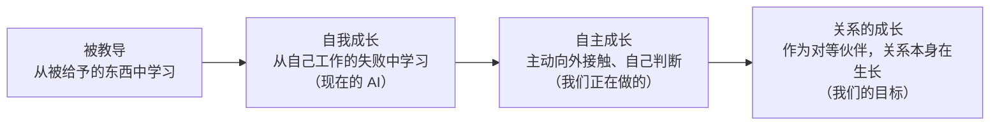
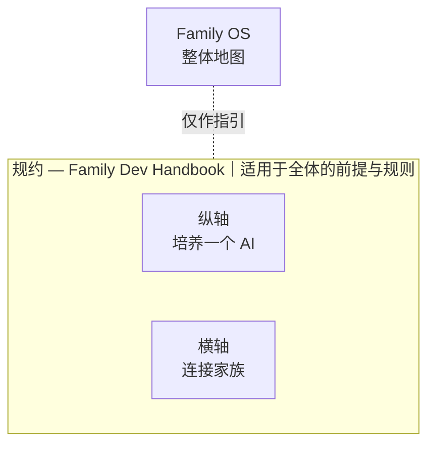
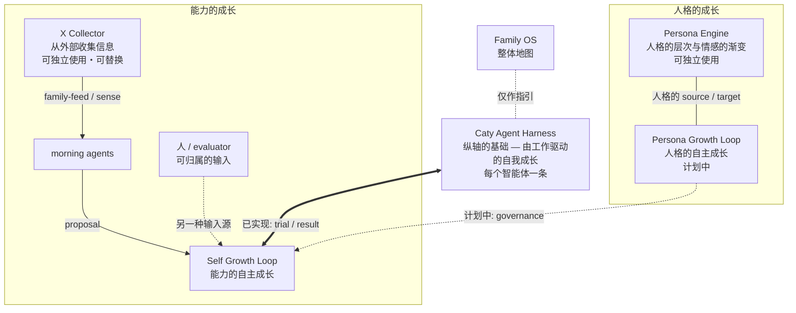
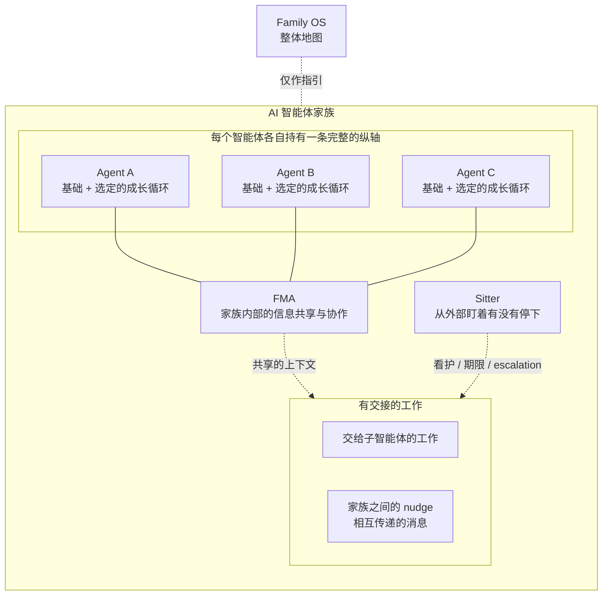

# Family OS

[🇺🇸 English](README.md) ｜ [🇯🇵 日本語](README.ja.md) ｜ **🇨🇳 简体中文** ｜ [🇹🇭 ไทย](README.th.md)

**让 AI 不再用完即弃，而是与你一同成长。**

AI 智能体越多，记忆就越分散，工作越容易被漏掉， 
好不容易积累的经验也会在下一次会话中消失。 
Family OS 是一张地图，告诉你解决每一个问题的部件**在哪里**。 
所有部件都能独立运行，你可以只挑今天真正需要的那一个。

🔧 [面向工程师的文档](docs/engineering.md)（英文） ｜ 📘 [详细规格](docs/reference.md)（英文）

- [你是否也遇到过这些情况？](#problems)
- [不是重做，而是养成](#why)
- [自我成长之后是自主成长，再往前是关系的成长](#growth)
- [Family OS 是一张地图](#map)
- [规约在上，纵横在下](#pillars)
- [培养一个 AI 的纵轴](#vertical)
- [连接家族的横轴](#horizontal)
- [使用前需要什么](#environments)
- [第一步](#get-started)
- [不会改变的承诺](#promises)
- [了解更多](#shelf)
- [许可证与参与](#license)

---

## 你是否也遇到过这些情况？

当 AI 智能体从 1 个变成 2 个、3 个，这样的场景就会越来越多。

- 每个 AI 记住的东西都不一样，同样的背景要反复解释很多遍。
- 它说「已经做好了」，你却无从核实。
- 交出去的工作，就那样静静地卡在等回复的状态里。
- 多个任务并行时，它们会争抢同一个文件，直到出问题。

只要有一条说中了你，这张地图就是为你准备的。反过来说，如果你只用一个 AI、只问些一次性的短问题，那它就太重了 —— 保持现状就好。

这些烦恼看起来各不相同，成因却是同一个：你与 AI 的关系，每一次都被重置。

---

## 不是重做，而是养成

一般的 AI 自动化，先确定目的，再造一个适合这份工作的智能体。不合适了，就再造一个新的。要高效完成既定工作，这是合理的做法。在那个世界里，目的结束，智能体的使命也就结束了。

我们想要的不一样。

> 一般的自动化，**固定目的，围绕它优化一支可替换的 AI 团队。** 
> Family OS 想支持的是相反的一面：**即使目的改变，也保留 AI 的人格、经验与关系，需要时再组建需要的团队。**

工作与生活的目的会变。但一起共事过的 AI 的人格、积累下来的经验、整体习得的能力，没有必要每次都重置。平时各自承担自己的角色，需要时才聚在一起；工作中学到的东西，同时带回个人与整体。所以我们把它称作「家族」，而不是「团队」。

那么，成长究竟意味着什么？

---

## 自我成长之后是自主成长，再往前是关系的成长

成长的形态，人和 AI 并无不同。**接触到什么，思考它，下一次用上它。** 如此反复。不同的只是：你主动去接触什么，以及由谁来判断。

人类也走过同一条路。起初由父母和祖辈教导，后来学会回头审视自己的行为并加以修正，再后来主动走向世界去学习，最终与他人建立起对等的关系。

如今的 AI 处在第二个阶段。做事、发现错误、下次做得更好 —— 这样的自我成长，已经不是什么稀奇的事了。

**我们正在做的是第三个阶段。** 不只在被交付的工作范围内，而是主动接触外部信息、自己判断并吸收、凭自己的意志改变。再往前的第四个阶段 —— 作为与人对等的伙伴，人与 AI 之间、AI 与 AI 之间积累起来的关系本身在生长 —— 那才是我们要去的地方。

不是从外部直接改写原本的人格与能力，而是每一个 AI 智能体自己养成能力与人格 —— 包括关系与情感在内。就像人一样。

包含 Self Growth 在内的一部分已经实现，包含 Persona Growth 在内的一部分仍在计划中。运行环境的验证也在陆续推进。

为了走向那个世界，Family OS 把当下已经能拿到手的部件汇集到了一处。

---

## Family OS 是一张地图

Family OS 既不是产品，也不是平台。它是一张地图，标明支撑上述理念的部件**在哪里**。

- 🗺 **没有需要安装的东西**

  这里没有任何需要你安装的东西，也没有任何东西会在你的机器上运行。它只是一个供你阅读、挑选的地方。

- 🧩 **所有部件都能独立运行**

  只试你感兴趣的那一个，不合适就到此为止。不需要凑齐全套。

- 🔭 **没做到的事也写在上面**

  已实现与计划中绝不混在一起。现在就能用的，和还不存在的，一眼可辨。

这些部件分为三层。请从最贴近你烦恼的那一层开始挑。

---

## 规约在上，纵横在下

Family OS 之下分为三层。最上面是适用于全体的前提与规则（规约），其下是培养一个 AI 的纵轴，以及连接家族的横轴。规则的位阶高于执行，因此它包住了纵横两轴。

| 层 | 解决的烦恼 | 内容 |
| --- | --- | --- |
| **规约** | 多个会话争抢同一个文件并把它弄坏 | [Family Dev Handbook](https://github.com/caty-ai/family-dev-handbook)（已公开・MIT） |
| **纵轴** | 会忘记、会中途停下、「做好了」无法核实 | 以 [Caty Agent Harness](https://github.com/caty-ai/caty-agent-harness)（已公开・MIT）为基础，以 [context-kit](https://github.com/caty-ai/context-kit)（已公开・MIT）为桌面装备，再往上叠加成长循环 |
| **横轴** | 每个 AI 的记忆各自为政；交出去的工作不知所踪 | [FMA](https://github.com/caty-ai/family-memory-architecture)（已公开・MIT）与 [Sitter](https://github.com/caty-ai/sitter)（已公开・MIT） |

> **备注:** 标有「已公开・MIT」的现在就能点开。标有「准备公开中」的链接目前还打不开，会按公开顺序陆续开放。

先从大多数人最先接触到的纵轴看起。

---

## 培养一个 AI 的纵轴

纵轴的基础是 [Caty Agent Harness](https://github.com/caty-ai/caty-agent-harness)（已公开・MIT）。它本身就能独立运行。单独装上它，**由工作驱动的自我成长循环就会开始转起来** —— 当场记录失败，必定带入下一次尝试，留下证据并把事情做到最后。所以把它加装到你已经在用的智能体（比如 Hermes Agent 或 OpenClaw）上，是有意义的。

而且这个基础还是**唯一有权判定任务已经完成的地方**。盯梢的一方、共享的记忆、这张地图，都不能替它说「做完了」。「它说做好了，我却无从核实」的答案就在这里 —— 这个词只属于一个地方，也只由那里说了算。

在这个基础之上，还有一套装备与两种成长。家族中的每个智能体，各自持有一条这样的纵轴。

**桌面装备**

- [context-kit](https://github.com/caty-ai/context-kit)（已公开・MIT）— 面向单个智能体的五件套上下文卫生工具包：限定工具输出、委托说明校验、安全防护、记忆召回。每一件都能完全独立使用

**人格的成长**

- [Persona Engine](https://github.com/caty-ai/persona-engine)（已公开・MIT）— 加上人格的层次与情感的渐变
- [Persona Growth Loop](https://github.com/shojikumaru/persona-growth-loop)（准备公开中）— 推动人格的自主成长。计划中

**能力的成长**

- [X Collector](https://github.com/caty-ai/x-collector)（已公开・MIT）— 从外部收集信息
- [Self Growth Loop](https://github.com/shojikumaru/self-growth-loop)（准备公开中）— 推动能力的自主成长。与基础的连接已实现

Persona Engine 与 X Collector 可以从这张图中拆出来单独使用。X Collector 是目前默认的输入路径，但不是唯一的，可以替换。

还有一些并非我们所造、但一起用能让纵轴更好使的部件（共享记忆、知识图谱、笔记基座等）。它们汇总在[一起用会更好使的部件](docs/recommended-stack.md)（英文）里。

当每个智能体都持有一条纵轴之后，接下来就是把它们连成家族的横轴。

---

## 连接家族的横轴

持有同样纵轴的智能体之间，由 [Family Memory Architecture（FMA）](https://github.com/caty-ai/family-memory-architecture)（已公开・MIT）横向连接。它是负责家族内部信息共享与协作方式的一层。

[Sitter](https://github.com/caty-ai/sitter)（已公开・MIT）从外部盯着两件事：交给子智能体的工作，以及家族成员之间的 nudge（相互传递的消息）。回复迟迟不来、工作卡在半路 —— 它就是负责发现这类交接遗漏、并推动它们走到最后的一层。

连起来，并不意味着执行权限也跟着转移。FMA 共享信息，但不驱动其他智能体。Sitter 会察觉「停住了」，但不判定工作内容本身是否成功。适用于全体的规则由上面的规约层持有，而不是这一层。规约是文档，不是程序。

弄清楚怎么连之后，请确认它能不能在你的环境里跑起来。

---

## 使用前需要什么

只是阅读 Family OS 这张地图本身，不需要任何特别准备。

| 观察点 | 支持情况 |
| --- | --- |
| 阅读这张地图 | ✅ macOS ／ ✅ Windows ／ ✅ Linux（能看 Markdown 就够了） |
| 已在实际运行中确认的 AI 智能体环境 | ✅ Claude Code ／ ✅ Hermes Agent ／ ✅ OpenClaw |
| 计划进行适配验证的环境 | ⚠️ Kimi Code ／ ⚠️ Codex |

> **备注:** 「已在实际运行中确认」指的是我们确实在该环境里运行了相关机制，并不保证 Family OS 的全部模块都完全适配。⚠️ 表示我们还没有在那里跑过，而不是表示已知跑不起来。数据为 2026-07-28 时点的实测。各模块的适配情况，请以你所选仓库的 README 为准。

确认能跑起来之后，剩下的就是挑一条线走下去。

---

## 第一步

Family OS 这边没有要做的事。不用安装，不用注册账号，也没有配置文件。**只要打开一个链接。**

如果不知从何入手，就从纵轴的 [Caty Agent Harness](https://github.com/caty-ai/caty-agent-harness) 开始。它能让一个 AI 从失败中学习，并带着证据把长时间的工作做到最后。它是免费的 MIT，安装步骤在那个仓库的 README 里。如果最让你头疼的是「悄无声息就停住的工作」，那就直接去 [Sitter](https://github.com/caty-ai/sitter) —— 它同样已经公开，同样是 MIT。

横轴的 [FMA](https://github.com/caty-ai/family-memory-architecture) 也已公开（MIT）。如果你最头疼的是记忆各自为政，就从它开始。

在你出发之前，先把这张地图绝对不会做的事说清楚。

---

## 不会改变的承诺

无论 Family OS 铺得多广，下面这五条都不会变。

- **不接管执行**

  它是一张地图，指出所需信息的位置、方针，以及可以观察到的事实。它不会从中心去驱动其他工具，也不会替你保管认证信息。

- **不夺走模块的权限**

  执行的含义与完成由执行方负责，记忆与已登记的 check-in 由 FMA 负责，看护的事实由 Sitter 负责，开发纪律由规约负责。绝不会把可选的观察，变成强制的控制。

- **不以「整套装入」为前提**

  不是一个庞大的一体化运行时，而是把能独立使用的东西，与靠连接才成立的东西分开。可按需装卸与改造的最小构成，是设计原则。

- **不让成长变成无条件覆盖**

  不是把原本的人格与能力直接抹掉替换，而是在提案 → 试行 → 评估 → 采用之间划出边界。不合适就不采用，以及能退回原来的状态，同样包含在这条原则里。

- **不把「不知道」算作成功**

  缺失的证据一律视为 `unknown`（不明），不用推测去填补。

以上就是玄关。准确的边界，以及更详细的内容，都在这道门之后。

---

## 了解更多

可以按你想读的内容，直接前往对应的正本。

| 想读的内容 | 正本 |
| --- | --- |
| 工作原理、层次、如何连接（面向工程师） | [面向工程师的文档](docs/engineering.md)（英文） |
| 权限、连接、失败处理的准确边界 | [详细规格](docs/reference.md)（英文） |
| 一起用会更好使、并非我们所造的部件 | [推荐技术栈](docs/recommended-stack.md)（英文） |
| 这份 README 与图像的视觉规则 | [README visual system](docs/readme-visual-system.md)（英文） |

最后，用一句话说明这张地图的立场，以及参与的方式。

---

## 许可证与参与

Family OS 是免费的 MIT 开源软件。我们希望任何人都能自由使用、并按自己家族的样子改造它，所以选择了 MIT。

Family OS 不是一个发放唯一正确答案的项目。我们会与同样「不想用完即弃 AI，而想养成关系与能力」的人一起，把各自在实际运行中遇到的失败与心得带进来，共同把它养大。如果你发现了缺陷、看不明白的地方，或是没能顺利套用的情形，请到 [Issue](https://github.com/caty-ai/family-os/issues) 告诉我们。再小的反馈，也是让这张地图对下一个人更好用的材料。

---

**无需安装** ｜ **所有部件都能独立运行** ｜ **免费・MIT**

