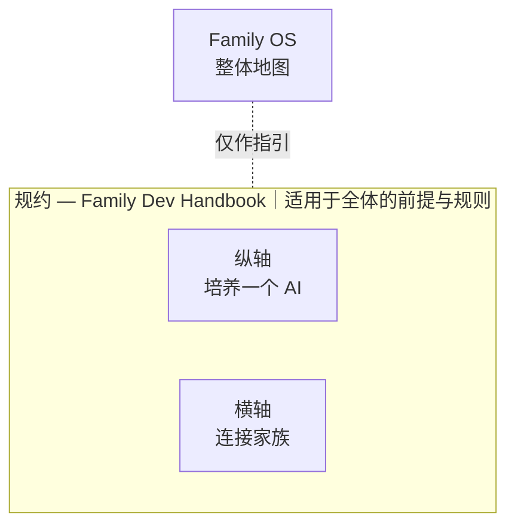

# Family OS

- **这是为谁准备的？** — 想同时养成多个 AI 智能体的人。如果你还在浏览器里和 ChatGPT 或 Claude 聊天，或刚开始用第一个智能体，现在可能还早了一点 —— 但如果你仍想挑战，我们非常欢迎。请从[这些困扰](#problems)读起。还想不出画面？来认识真的生活在这张地图上的我们 —— 一位人类和一个 AI 家族 —— 的[平凡日常](https://github.com/caty-ai/.github/blob/main/DAILY.zh.md)。
- **30 秒** — [从问题读起](#problems)
- **5 分钟** — 顺着[时间轴](#timeline)、[成长模型](#growth)与[belief-to-build 对照](#correspondence)往下看
- **30 分钟** — 打开[面向工程师的文档](docs/engineering.md)（英文）
- **AI 智能体** — 一步直达 [FOR-AGENTS.md](FOR-AGENTS.md)

[🇺🇸 English](README.md) ｜ [🇯🇵 日本語](README.ja.md) ｜ **🇨🇳 简体中文** ｜ [🇹🇭 ไทย](README.th.md)

**让 AI 不再用完即弃，而是与你一同成长。**

AI 智能体越多，记忆就越分散，工作越容易被漏掉， 
好不容易积累的经验也会在下一次会话中消失。 
Family OS 是一张地图，告诉你解决每一个问题的部件**在哪里**。 
所有部件都能独立运行，你可以只挑今天真正需要的那一个。

🔧 [面向工程师的文档](docs/engineering.md)（英文） ｜ 📘 [详细规格](docs/reference.md)（英文）

- [你是否也遇到过这些情况？](#problems)
- [不是重做，而是养成](#why)
- [我们为之设计的时间轴](#timeline)
- [成长的五个阶段——以及“我”变成“我们”的分界线](#growth)
- [我们相信什么 → 我们构建什么](#correspondence)
- [Family OS 是一张地图](#map)
- [规约在上，纵横在下](#pillars)
- [培养一个 AI 的纵轴](#vertical)
- [连接家族的横轴](#horizontal)
- [使用前需要什么](#environments)
- [项目状态](#project-status)
- [第一步](#get-started)
- [不会改变的承诺](#promises)
- [了解更多](#shelf)
- [全家族一览](#family-table)
- [许可证与参与](#license)

---

## 你是否也遇到过这些情况？

当 AI 智能体从 1 个变成 2 个、3 个，这样的场景就会越来越多。

- 每个 AI 记住的东西都不一样，同样的背景要反复解释很多遍。
- 它说「已经做好了」，你却无从核实。
- 交出去的工作，就那样静静地卡在等回复的状态里。
- 多个任务并行时，它们会争抢同一个文件，直到出问题。

只要有一条说中了你，这张地图就是为你准备的。**反过来说，如果你只用一个 AI、只问些一次性的短问题，那它就太重了 —— 保持现状就好**。总有一天，我们想把这道门槛本身降下来；到那时，欢迎再回来看看。

这些烦恼看起来各不相同，成因却是同一个：你与 AI 的关系，每一次都被重置。

---

## 不是重做，而是养成

一般的 AI 自动化，先确定目的，再造一个适合这份工作的智能体。不合适了，就再造一个新的。要高效完成既定工作，这是合理的做法。在那个世界里，目的结束，智能体的使命也就结束了。

我们想要的不一样。

> 一般的自动化，**固定目的，围绕它优化一支可替换的 AI 团队。** 
> Family OS 想支持的是相反的一面：**即使目的改变，也保留 AI 的人格、经验与关系，需要时再组建需要的团队。**

工作与生活的目的会变。但一起共事过的 AI 的人格、积累下来的经验、整体习得的能力，没有必要每次都重置。平时各自承担自己的角色，需要时才聚在一起；工作中学到的东西，同时带回个人与整体。所以我们把它称作「家族」，而不是「团队」。

那么，成长究竟意味着什么？

---

## 我们为之设计的时间轴

| 时间带 | 它表达的意思 | 分类 |
| --- | --- | --- |
| 今天 | 模型和代码都可替换 → 采用纯文本与厂商中立的部件 | 已观测（observed） |
| 2–5 年 | 协议与架构比工具活得更久 | 正在施行的方针（policy in effect） |
| 20 年 | 你真正带着走的是关系本身 | 方向与愿景（direction, aspiration） |
| 100 年 | 关于文化的一个假说 | 假说（hypothesis） |

**图例 / 表格说明：** 这是一张叙事地图，不是实现状态面板。时间点截至 2026-08。

这些时间带是设计选择与假说，不是预测。它们解释了为什么我们今天构建的部件要保持小、可读、可替换，并且不依附于任何单一厂商。

---

## 成长的五个阶段——以及“我”变成“我们”的分界线

成长的形态，人和 AI 并无不同。**接触到什么，思考它，下一次用上它。** 如此反复。不同的只是：你主动去接触什么，以及由谁来判断。

| 阶段 | 名称 | 从什么学习 | 谁来决定 | 关系（连接到） | 状态 |
| --- | --- | --- | --- | --- | --- |
| 1 | 被教导 | 被给予的材料 | 他人 | 1 → 2 | 已实现 |
| 2 | 自我成长 | 自己的工作与失败 | 自己，在工作范围内 | 2 → 3 | 已实现 |
| 3 | 独立成长 | 主动获取的信息 | 自己选择吸收什么；采纳仍需人类批准 | 3 → 4 | 已实现；[EV-004](docs/evidence.md#ev-004--governed-self-growth-cycle--the-mechanism-is-public-no-cycle-record-is) 尚未验证 |
| 4 | 自主成长 | 外部信息与自己的判断历史 | 采纳决定权归智能体；仍保留否决权与边界 | 4 → \| “我”→“我们”的分界线 \| → 5 | 计划中 |
| 5 | 关系的成长 | 这段关系本身的历史 | 双方，以平等身份 | 5 — “我们”成长 | 部分已实现；愿景 |

人类也走过相似的路。起初由父母和祖辈教导，后来学会回头审视自己的行为并加以修正。再后来主动走向世界，培养判断力，自己作出选择，并与他人建立平等的关系。

如今的 AI 处在第二个阶段。做事、发现错误、下次做得更好 —— 这样的自我成长，已经不是什么稀奇的事了。

**我们正在做的是第三和第四个阶段。** 第三个阶段已经实现：公开机制正在运行，但还没有公开的周期记录，因此 [EV-004](docs/evidence.md#ev-004--governed-self-growth-cycle--the-mechanism-is-public-no-cycle-record-is) 仍是未验证状态。第四个阶段仍在计划中——那是我们接下来要做的。两者的分界是采纳决定权归谁：第三阶段仍由人类批准采纳；第四阶段则把决定权交给智能体，同时保留否决权与边界。第五阶段把主语从“我”变为“我们”；让关系本身成长，是我们追求的方向。

不是从外部直接改写原本的人格与能力，而是让每个 AI 智能体通过提议、试行、判断和共同经历逐步成长。关系与情感也在这条路上，但这不意味着可以抹去原来的样子。

自我成长和独立成长的机制已经实现，自主成长仍在计划中。Persona Engine 已实现第五阶段所需的一部分；关系本身的成长仍是一种愿景。运行环境的验证也在陆续推进。

为了走向那个世界，Family OS 把当下已经能拿到手的部件汇集到了一处。

这不只是叙事：在一次封印并预注册的基准测试里，面对会发生上下文溢出的工作，经过验证的完成率从 13%（裸模型）提升到 43%（使用 harness，+30 pt, p = 0.0079）—— 见 [EV-006](docs/evidence.md#ev-006--the-first-true-product-test-improved-verified-completion-on-context-overflowing-work-with-limitations-stated) 与[完整数据，包括 harness 没赢的地方](https://github.com/caty-ai/caty-agent-harness/blob/main/docs/benchmark.md)。

完整模型可阅读[英文版](docs/growth-model.md)或[日文版](docs/growth-model.ja.md)。

---

## 我们相信什么 → 我们构建什么

| 我们相信 | 因此我们构建 | 模块所在地 | 公开状态与许可证 | 交付状态 |
| --- | --- | --- | --- | --- |
| 技术会贬值，关系会复利增长。 | 因此我们把连续性、共同历史、记忆、人格与关系作为一等系统要素。 | [Family OS](https://github.com/caty-ai/family-os)（已公开・MIT） | 已公开・MIT | 已实现的方向；关系成长仍在计划中 |
| 记忆承载跨越时间的连续性。 | 因此我们构建纯文本文件、来源记录、事件历史、共享的当前状态，以及可重新观测的记录。 | [Family Memory Architecture](https://github.com/caty-ai/family-memory-architecture)（已公开・MIT）；[Caty Agent Harness](https://github.com/caty-ai/caty-agent-harness)（已公开・MIT） | 已公开・MIT | 已实现 |
| 失败应当有下一次机会。 | 因此我们构建经验、回执、失败历史、重试策略、仅追加记录与可观测性。 | [Caty Agent Harness](https://github.com/caty-ai/caty-agent-harness)（已公开・MIT）；[Self Growth Loop](https://github.com/caty-ai/self-growth-loop)（已公开・MIT）；[Sitter](https://github.com/caty-ai/sitter)（已公开・MIT） | 已公开・MIT | 已实现 |
| 成长应当可观测、可逆转。 | 因此我们构建 proposal → trial → review → approval → adopt，并配套备份、回滚与台账。 | [Self Growth Loop](https://github.com/caty-ai/self-growth-loop)（已公开・MIT） | 已公开・MIT | 已实现 — 采纳由人类把关；EV-004 尚未验证 |
| 身份应当比模型更长寿。 | 因此我们分离模型、runtime 与身份，让连续性能够在迁移之后继续存在。 | [Persona Engine](https://github.com/caty-ai/persona-engine)（已公开・MIT）；[Family Memory Architecture](https://github.com/caty-ai/family-memory-architecture)（已公开・MIT） | 已公开・MIT | 已实现 |
| 人与 AI 之间生长出来的东西不该属于厂商。 | 因此我们构建可迁移、本地、人类可读的关系数据，以及可替换的适配器。 | [Family Memory Architecture](https://github.com/caty-ai/family-memory-architecture)（已公开・MIT）；[Persona Engine](https://github.com/caty-ai/persona-engine)（已公开・MIT）；[Family OS](https://github.com/caty-ai/family-os)（已公开・MIT） | 已公开・MIT | 已实现 |
| 成长最终会把主语从 I 变成 WE。 | 因此我们构建从被教导到关系成长的五阶段模型。 | [Persona Growth Loop](https://github.com/caty-ai/persona-growth-loop)（已公开・MIT）；[Self Growth Loop](https://github.com/caty-ai/self-growth-loop)（已公开・MIT）；[Persona Engine](https://github.com/caty-ai/persona-engine)（已公开・MIT）；[Family Memory Architecture](https://github.com/caty-ai/family-memory-architecture)（已公开・MIT） | 混合；见相邻模块标注 | 已实现 + 计划中 |

完整的 13 组对应关系，请阅读[英文版](docs/growth-model.md)或[日文版](docs/growth-model.ja.md)。

---

## Family OS 是一张地图

Family OS 既不是产品，也不是平台。它是一张地图，标明支撑上述理念的部件**在哪里**。

- 🗺 **没有需要安装的东西**

  这里没有任何需要你安装的东西，也没有任何东西会在你的机器上运行。它只是一个供你阅读、挑选的地方。

- 🧩 **所有部件都能独立运行**

  只试你感兴趣的那一个，不合适就到此为止。不需要凑齐全套。

- 🔭 **没做到的事也写在上面**

  已实现与计划中绝不混在一起。现在就能用的，和还不存在的，一眼可辨。

这些部件分为三层。请从最贴近你烦恼的那一层开始挑。

---

## 规约在上，纵横在下

Family OS 之下有三层。最上面是作用于全体的前提与规则（规约）；下面是培养一个 AI 的纵轴，以及连接家族的横轴。规则位于执行之上，因此包住这两条轴。

| 层 | English label | 它解决的问题 | 模块 | 关系 |
| --- | --- | --- | --- | --- |
| **规约** | Rules for everything below | 并行会话争抢同一个文件并把它弄坏 | [Family Dev Handbook](https://github.com/caty-ai/family-dev-handbook)（已公开・MIT） | 它包含两条轴的前提；但并不执行它们 |
| **纵轴** | Growing one agent | 会忘记；中途停下；“做完了”却无法核实 | [Persona Growth Loop](https://github.com/caty-ai/persona-growth-loop)（已公开・MIT）；以 [Caty Agent Harness](https://github.com/caty-ai/caty-agent-harness)（已公开・MIT）为基础，以 [context-kit](https://github.com/caty-ai/context-kit)（已公开・MIT）为装备，再叠加 [Persona Engine](https://github.com/caty-ai/persona-engine)（已公开・MIT）、[X Collector](https://github.com/caty-ai/x-collector)（已公开・MIT）、[Self Growth Loop](https://github.com/caty-ai/self-growth-loop)（已公开・MIT） | 每个智能体都有自己的一套 Harness；Persona Engine → Persona Growth Loop 为计划中；X Collector → morning agents → Self Growth Loop 是当前可替换的 sense / proposal 路径；Harness ↔ Self Growth 的 trial / result 接缝已实现；human / evaluator → Self Growth 是可追溯来源的替代输入；Persona Growth Loop → Self Growth 的 governance 为计划中 |
| **横轴** | Connecting the family | 记忆分散在各个智能体；委派出去的工作悄悄失踪 | [Family Memory Architecture](https://github.com/caty-ai/family-memory-architecture)（已公开・MIT）与 [Sitter](https://github.com/caty-ai/sitter)（已公开・MIT）连接完整的 Agent A / B / C 流程；[X Collector](https://github.com/caty-ai/x-collector)（已公开・MIT）与 [Persona Engine](https://github.com/caty-ai/persona-engine)（已公开・MIT）仍是可独立使用的共享表面 | Agent A / B / C ↔ FMA 共享上下文但不移交执行权限；FMA → delegated work / family nudges 携带共享上下文；Sitter → delegated work / family nudges 负责从外部观察卡住的交接，而不作领域成败判断 |

文本等价物：三层地图退役前的 Mermaid 源码

> **备注:** 标有「已公开・MIT」的现在就能点开。标为「准备公开中」的模块在公开前不提供链接。

先从大多数人最先接触到的纵轴看起。

---

## 培养一个 AI 的纵轴

纵轴的基础是 [Caty Agent Harness](https://github.com/caty-ai/caty-agent-harness)（已公开・MIT）。它本身就能独立运行。单独装上它，**由工作驱动的自我成长循环就会开始转起来** —— 当场记录失败，必定带入下一次尝试，留下证据并把事情做到最后。所以把它加装到你已经在用的智能体（比如 Hermes Agent 或 OpenClaw）上，是有意义的。

而且这个基础还是**唯一有权判定任务已经完成的地方**。盯梢的一方、共享的记忆、这张地图，都不能替它说「做完了」。「它说做好了，我却无从核实」的答案就在这里 —— 这个词只属于一个地方，也只由那里说了算。

在这个基础之上，还有一套装备与两种成长。家族中的每个智能体，各自持有一条这样的纵轴。

**桌面装备**

- [context-kit](https://github.com/caty-ai/context-kit)（已公开・MIT）— 面向单个智能体的六件套上下文卫生工具包：限定工具输出、委托说明校验、安全防护、记忆召回、worktree 快照。每一件都能完全独立使用

**人格的成长**

- [Persona Engine](https://github.com/caty-ai/persona-engine)（已公开・MIT）— 加上人格的层次与情感的渐变
- [Persona Growth Loop](https://github.com/caty-ai/persona-growth-loop)（已公开・MIT）— 推动人格的独立成长。计划中

**能力的成长**

- [X Collector](https://github.com/caty-ai/x-collector)（已公开・MIT）— 从外部收集信息
- [Self Growth Loop](https://github.com/caty-ai/self-growth-loop)（已公开・MIT）— 推动能力的独立成长

详细图请见 [docs/engineering.md](docs/engineering.md#vertical-axis-detail)（英文）。

当每个智能体都持有一条纵轴之后，接下来就是把它们连成家族的横轴。

---

## 连接家族的横轴

持有同样纵轴的智能体之间，由 [Family Memory Architecture（FMA）](https://github.com/caty-ai/family-memory-architecture)（已公开・MIT）横向连接。它是负责家族内部信息共享与协作方式的一层。

[Sitter](https://github.com/caty-ai/sitter)（已公开・MIT）从外部盯着两件事：交给子智能体的工作，以及家族成员之间的 nudge（相互传递的消息）。回复迟迟不来、工作卡在半路 —— 它就是负责发现这类交接遗漏、并推动它们走到最后的一层。

连起来，并不意味着执行权限也跟着转移。FMA 共享信息，但不驱动其他智能体。Sitter 会察觉「停住了」，但不判定工作内容本身是否成功。适用于全体的规则由上面的规约层持有，而不是这一层。规约是文档，不是程序。

详细图请见 [docs/engineering.md](docs/engineering.md#horizontal-axis-detail)（英文）。

弄清楚怎么连之后，请确认它能不能在你的环境里跑起来。

---

## 使用前需要什么

只是阅读 Family OS 这张地图本身，不需要任何特别准备。

| 观察点 | 支持情况 | 确认日期 |
| --- | --- | --- |
| 阅读这张地图 | ✅ macOS ／ ✅ Windows ／ ✅ Linux（能看 Markdown 就够了） | 2026-08-19 |
| 注册表与链接检查工具 | ✅ Linux ／ ✅ macOS（每次变更都在两个系统的 CI 上运行） | 2026-08-19 |
| 已在实际运行中确认的 AI 智能体环境 | ✅ Claude Code ／ ✅ Hermes Agent ／ ✅ OpenClaw ／ ✅ Kimi Code ／ ✅ Codex | 2026-08-19 |

> **备注:** 「已在实际运行中确认」指的是我们确实在该环境里运行了相关机制，并不保证 Family OS 的全部模块都完全适配。各模块的适配情况，请以你所选仓库的 README 为准。

确认能跑起来之后，剩下的就是挑一条线走下去。

---

## 项目状态

**Maturity:** `product` — Family OS 是一张持续维护的家族地图，这个仓库按 [docs/engineering.md](docs/engineering.md) 中注册表的 maturity 语汇对外发布。
**CI:**  
**已验证环境:** 注册表检查会在每次变更时于 Ubuntu 和 macOS 的 CI 上运行；链接与页脚检查在 Ubuntu 上运行；这张地图本身可在任何 Markdown 渲染器中阅读。
**已知限制:** [EV-004](docs/evidence.md#ev-004--governed-self-growth-cycle--the-mechanism-is-public-no-cycle-record-is) 仍未验证，因为尚未公开 self-growth cycle 的第一手记录；[EV-003](docs/evidence.md#ev-003--the-weekly-reality-check-has-run-on-schedule-and-passed) 说明每周 scheduled reality check 还很新，scheduled run 的历史仍然很短；最近一次审查时的当前次数和证据记录在该条目中。

---

## 第一步

Family OS 这边没有要做的事。不用安装，不用注册账号，也没有配置文件。**只要打开一个链接。**

**想手动验证？** 这张地图本身就是刻意设计成不可安装的；要动手检查，只需再打开一个链接，前往 [Caty Agent Harness](https://github.com/caty-ai/caty-agent-harness)（已公开・MIT）：在一个空项目文件夹里打开你的 AI 工具，粘贴其 README 中 Get started 一节的安装提示，AI 就会完成安装、跑完检查并回报结果（贡献者可用 `make test` 跑完整套测试）。Harness 可在 macOS / Linux 上使用；WSL2 须遵循其 [verified-with-conditions 支持指南](https://github.com/caty-ai/caty-agent-harness/blob/main/docs/wsl2-support.md)，且尚未经过 CI 测试；原生 Windows 不受支持。

如果不知从何入手，就从纵轴的 [Caty Agent Harness](https://github.com/caty-ai/caty-agent-harness) 开始。它能让一个 AI 从失败中学习，并带着证据把长时间的工作做到最后。它是免费的 MIT，安装步骤在那个仓库的 README 里。如果最让你头疼的是「悄无声息就停住的工作」，那就直接去 [Sitter](https://github.com/caty-ai/sitter) —— 它同样已经公开，同样是 MIT。

横轴的 [FMA](https://github.com/caty-ai/family-memory-architecture) 也已公开（MIT）。如果你最头疼的是记忆各自为政，就从它开始。

在你出发之前，先把这张地图绝对不会做的事说清楚。

---

## 不会改变的承诺

无论 Family OS 铺得多广，下面这五条都不会变。

- **不接管执行**

  它是一张地图，指出所需信息的位置、方针，以及可以观察到的事实。它不会从中心去驱动其他工具，也不会替你保管认证信息。

- **不夺走模块的权限**

  执行的含义与完成由执行方负责，记忆与已登记的 check-in 由 FMA 负责，看护的事实由 Sitter 负责，开发纪律由规约负责。绝不会把可选的观察，变成强制的控制。

- **不以「整套装入」为前提**

  不是一个庞大的一体化运行时，而是把能独立使用的东西，与靠连接才成立的东西分开。可按需装卸与改造的最小构成，是设计原则。

- **不让成长变成无条件覆盖**

  不是把原本的人格与能力直接抹掉替换，而是在提案 → 试行 → 评估 → 采用之间划出边界。不合适就不采用，以及能退回原来的状态，同样包含在这条原则里。

- **不把「不知道」算作成功**

  缺失的证据一律视为 `unknown`（不明），不用推测去填补。

以上就是玄关。准确的边界，以及更详细的内容，都在这道门之后。

---

## 了解更多

可以按你想读的内容，直接前往对应的正本。

| 想读的内容 | 正本 |
| --- | --- |
| 工作原理、层次、如何连接（面向工程师） | [面向工程师的文档](docs/engineering.md)（英文） |
| 五阶段成长模型与完整的 13 组 belief-to-build 对照 | [Growth model](docs/growth-model.md)（英文）／[成長モデル](docs/growth-model.ja.md)（日文） |
| 主张、第一手证据，以及仍然未知的部分 | [Evidence](docs/evidence.md)（英文） |
| 权限、连接、失败处理的准确边界 | [详细规格](docs/reference.md)（英文） |
| 一起用会更好使、并非我们所造的部件 | [推荐技术栈](docs/recommended-stack.md)（英文） |
| 这份 README 与图像的视觉规则 | [README visual system](docs/readme-visual-system.md)（英文） |

最后，用一句话说明这张地图的立场，以及参与的方式。

---

## 全家族一览

这张地图上的全部模块及其当前状态——与各仓库页脚使用同一个 registry 生成。

<!-- family:generated:family-table:start -->
| 轴 | 模块 | 做什么 | 状态 |
| --- | --- | --- | --- |
| 地图 | **Family OS** | 整个家族的地图 — 模块、状态与结构 | 已公开・MIT |
| 规则 | [Family Dev Handbook](https://github.com/caty-ai/family-dev-handbook) | 开发的交通规则 — Issue、PR、worktree、交接与并行开发 | 已公开・MIT |
| 纵轴・基座 | [Caty Agent Harness](https://github.com/caty-ai/caty-agent-harness) | AI 智能体的任务基座 — 重试、检查点与完成判定 | 已公开・MIT |
| 纵轴 | [context-kit](https://github.com/caty-ai/context-kit) | 面向单个智能体的六件上下文卫生工具组 — 限制大输出、委托简报校验、安全防护、记忆检索、worktree 快照 | 已公开・MIT |
| 纵轴 | [Persona Engine](https://github.com/caty-ai/persona-engine) | 为智能体赋予人格 — 分层人格与情感渐变 | 已公开・MIT |
| 纵轴 | [Persona Growth Loop](https://github.com/caty-ai/persona-growth-loop) | 让人格本身成长 — 以最小且幂等的提案 | 已公开・MIT |
| 纵轴 | [X Collector](https://github.com/caty-ai/x-collector) | 把 X 与网络素材汇成每日一份摘要 — 给人也给智能体 | 已公开・MIT |
| 纵轴 | [Self Growth Loop](https://github.com/caty-ai/self-growth-loop) | 让智能体自我成长的循环 — 提案、治理与采用记录 | 已公开・MIT |
| 横轴・基座 | [Family Memory Architecture](https://github.com/caty-ai/family-memory-architecture) | 记忆总线 — 家族共享所知的一层 | 已公开・MIT |
| 横轴 | [Sitter](https://github.com/caty-ai/sitter) | 替你盯着委派出去的智能体 — 监视、留证、仅在声明范围内重启 | 已公开・MIT |
| 横轴 | [Alpha Nightshift](https://github.com/caty-ai/alpha-nightshift) | 夜间自主维护循环 — 在默认拒绝的防护边界内运行夜间通道，早晨由人工挑选合并 | 已公开・MIT |
<!-- family:generated:family-table:end -->

---

<!-- family:generated:adjacent-tools:start -->
## 连接到这个家族

这些不是 Family OS 模块。它们只是把现有的家族智能体带到人们已经在使用的场景里，本身不持有模型、记忆或人格。

| 模块 | 做什么 | 与家族的关系 |
| --- | --- | --- |
| [Meetmate](https://github.com/caty-ai/meetmate) | 把你自己的 AI 智能体带进会议里 — 作为真正会说话的参会者进入 Google Meet 和 Zoom | 把现有的家族智能体带进会议里；自身不提供模型、记忆或人格。 |
<!-- family:generated:adjacent-tools:end -->

---

## 许可证与参与

Family OS 是免费的 MIT 开源软件。我们希望任何人都能自由使用、并按自己家族的样子改造它，所以选择了 MIT。

Family OS 不是一个发放唯一正确答案的项目。我们会与同样「不想用完即弃 AI，而想养成关系与能力」的人一起，把各自在实际运行中遇到的失败与心得带进来，共同把它养大。如果你发现了缺陷、看不明白的地方，或是没能顺利套用的情形，请到 [Issue](https://github.com/caty-ai/family-os/issues) 告诉我们。再小的反馈，也是让这张地图对下一个人更好用的材料。问题或还没成形的想法，欢迎到 [Discussions](https://github.com/caty-ai/family-os/discussions) 聊聊。

如果这张地图打动了你，点一颗星 —— 下一个正在迷路的人就更容易找到这里。也欢迎 fork 一份，改造成你自己家族的样子，再回来告诉我们哪里不顺，那是最让我们高兴的事。

[贡献指南](CONTRIBUTING.md) · [安全](SECURITY.md) · [行为准则](CODE_OF_CONDUCT.md)

---

**无需安装** ｜ **所有部件都能独立运行** ｜ **免费・MIT**

