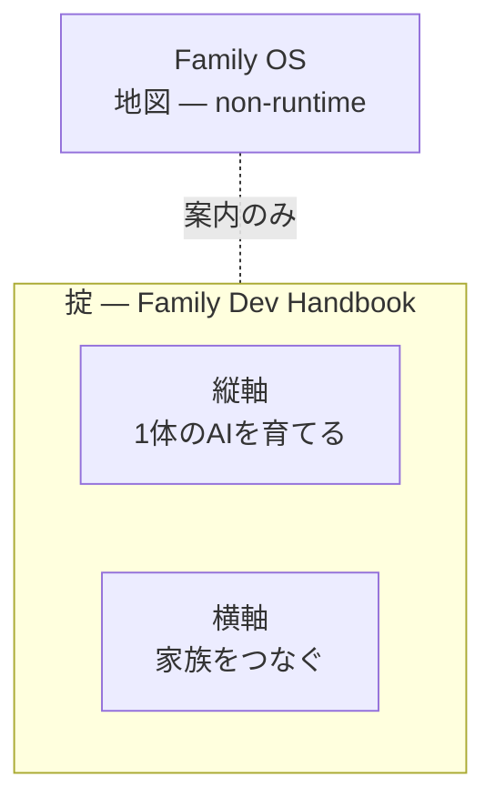
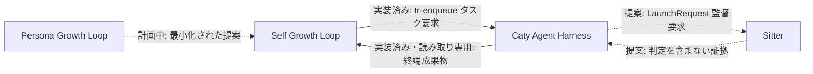

# Family OS — エンジニア向けドキュメント

[← 玄関へ戻る](../README.ja.md)

このページは地図の技術面です。エージェント・プロセス・契約という言葉に慣れている方を想定しています。同じ内容を専門用語なしで読みたい場合は、玄関がそのまま対応しています。

正確な契約 — 権限・エッジ・失敗時の扱いのすべて — は[詳細仕様](reference.ja.md)にあります。このページは形を説明し、あちらが形を固定します。

---

## このリポジトリは何か

Family OS は **non-runtime な層**です。方針・地図・ポインタ・観測の描画だけを持ちます。コードを持たず、プロセスを起動せず、ポートを開かず、認証情報を保管しません。

実務上の帰結が、いちばん覚えておく価値のある部分です。

- **すべての runtime モジュールは、このリポジトリを削除しても動き続けなければなりません。** 地図が無いと動かないモジュールがあるなら、地図はすでに制御装置になっており、設計が壊れています。
- **ここはレジストリではありません。** サービスディスカバリも、コールバック経路も、死活判定もありません。
- **ここはモジュールの契約を複製しません。** 各モジュールの挙動はそのリポジトリが正本で、ここが持つのはポインタと、そのポインタの鮮度だけです。

Family OS が権限を持って答える問いは、ただ1つ — *この文書は、自分の鮮度メタデータに照らして最新か*。それ以外に描画されているものは、すべて誰か他の所有物です。

---

## 3つの層

| 層 | 答えるもの | 正本 |
| --- | --- | --- |
| 掟 | 並行作業を壊さない進め方 — Issue・ブランチ・worktree・受け渡し | [Family Dev Handbook](https://github.com/caty-ai/family-dev-handbook) |
| 縦軸 | 1体のAIが、覚え・やり切り・育つ方法 | [Caty Agent Harness](https://github.com/caty-ai/caty-agent-harness) と成長ループ |
| 横軸 | 複数のAIが記憶を共有し、仕事を渡す方法 | [Family Memory Architecture](https://github.com/shojikumaru/family-memory-architecture) と [Sitter](https://github.com/caty-ai/sitter) |

掟の層は、どちらかの軸の内側ではなく**両方の上**にあります。掟はプログラムではなく文書です。人とAIがモジュールをどう開発するかを縛るだけで、runtime では何も強制しません。

---

## モジュール一覧

| モジュール | 種別 | 所有するもの | 状態 |
| --- | --- | --- | --- |
| [Caty Agent Harness](https://github.com/caty-ai/caty-agent-harness) | runtime・縦軸の基盤 | タスクの意味・試行・リトライ・チェックポイント・完了判定・完了・DLQ | 公開済み・MIT |
| [Persona Engine](https://github.com/caty-ai/persona-engine) | runtime・単独利用可能 | 人格のレイヤーと感情のグラデーション | 公開済み・MIT |
| [Sitter](https://github.com/caty-ai/sitter) | runtime・観測 | ローカルのプロセスと返信の事実・発注試行の証拠・委譲された同一試行の再起動 | 公開済み・MIT |
| [Family Memory Architecture](https://github.com/shojikumaru/family-memory-architecture) | runtime・横方向の基盤 | 記憶バス・登録されたスケジュールの期待・check-in・来歴 | 公開準備中 |
| [Self Growth Loop](https://github.com/shojikumaru/self-growth-loop) | runtime・アプリケーション | 提案・ガバナンス・採用記録・成長の解釈 | 公開準備中・基盤との接続は実装済み |
| [X Collector](https://github.com/caty-ai/x-collector) | runtime・任意の入力 | 能力ループ向けの外部素材の収集 | 公開済み・MIT |
| [Persona Growth Loop](https://github.com/shojikumaru/persona-growth-loop) | 計画中のフロントエンド | 最小化された冪等な提案の生成 | 公開準備中・計画中 |
| [Family Dev Handbook](https://github.com/caty-ai/family-dev-handbook) | non-runtime・ガバナンス | Issue・PR・worktree・受け渡し・並行開発のルール | 公開済み・MIT |

「公開準備中」のリンクは、いまはまだ開けません。何が存在し、どこに置かれるのかを地図として正直に保つために載せています。

Persona Engine と X Collector は単独で使え、他のどれからも必須とされていません。X Collector は能力ループへの現在の既定の入力経路ですが、唯一の経路ではなく置き換えられます。

---

## どうつながっているか

今日この時点で実装済みのモジュール間エッジは2本だけです。それ以外は、まだ消費者のいない形か、家族の外側の誰かが所有する境界です。

実装済みの2本は、後続のすべてのエッジの雛形なので、よく読む価値があります。

- **要求は、次の判断を所有するモジュールへ向かって流れます。** Self Growth Loop はタスクを投入しますが、タスクの状態・試行番号・リトライ方針・DLQ には決して書き込みません。それらは基盤のものです。
- **証拠は、権限を移さずに戻ってきます。** 基盤は相関づけられた終端成果物を publish します。終端は、採用でも適用でも有効でもありません — それらは別の3者が持つ、別の3つの事実です。

要求と証拠は逆向きに流れ、どちらも権限を運びません。このページから1文だけ持ち帰るなら、この1文にしてください。

---

## 主張の状態

[詳細仕様](reference.ja.md)のすべての記述は、4つの状態のいずれかを持ちます。飾りではなく、何の上に作ってよいかを決めるものです。

- **実装済み** — 今日存在し、証拠に裏付けられたインターフェース
- **決定済み** — 受け入れられた境界または慣行。コードがあるとは限らない
- **提案** — 形のみ。実装の承認ではない
- **不明** — 唯一の権限者が答えるまで、いかなる事実も推論してはならない

提案のエッジは、その契約所有者がバージョン交渉・移行・ロールバックまたはダウングレードの挙動を記録するまで、消費者を持てません。形を「進んでよい合図」と読むのが、ここで最も高くつく間違いです。

---

## Family OS が決してしないこと

これらは現時点の制約ではなく、構造上の拒否です。プロジェクトが大きくなっても失効しません。

- **runtime へのエッジを持ちません。** Family OS からも掟からも、runtime モジュールへ向かう矢印は1本もありません。足した時点で地図は制御装置になります。
- **権限を奪いません。** 他モジュールの事実を描画しても、その事実の所有権は動きません。
- **完了を捏造しません。** 任意や提案のエッジが存在しないとき、結果はローカルの進捗の保持か `unknown` であり、合成された成功ではありません。
- **秘密を持ちません。** 認証情報・スケジューラ・break-glass の経路は、そのデプロイを所有する人のものです。

いちばん被害が大きいのは曖昧な語です。`returned` `ack` `delivered` `healthy` `adopted` `applied` `effective` にはそれぞれ所有者がちょうど1人おり、[詳細仕様](reference.ja.md#vocabulary)で意図的に分割してあります。

---

## 1つ外したらどうなるか

境界が本物かどうかを試すいい方法は、そのモジュールを消して何が実際に壊れるかを問うことです。

| 外すもの | 失うもの | 残るもの |
| --- | --- | --- |
| Family OS | 連携の見通し | すべての runtime モジュール（無傷） |
| Family Dev Handbook | 開発の指針 | runtime の稼働 |
| Family Memory Architecture | 共有記憶と check-in の観測 | 各モジュール自身のドメイン状態 |
| Sitter | 任意の外部監督 | 基盤のタスク意味論とローカルの失敗時の姿勢 |
| Self Growth Loop | 成長のガバナンスと解釈 | 基盤の中のタスクと証拠 |
| Persona Growth Loop | 将来の提案入力 | いま動いているものすべて |

この表の上半分は、どれも runtime の状態を道連れにしません。層を分けている理由がまさにそこです。

---

## 使える環境

地図を読むだけなら Markdown ビューアがあれば足ります。下の表は、地図が指しているモジュールについてのものです。

| 観点 | 対応 |
| --- | --- |
| この地図を読む | ✅ macOS ／ ✅ Windows ／ ✅ Linux |
| 実運用が確認できているAIエージェント環境 | ✅ Claude Code ／ ✅ Hermes Agent ／ ✅ OpenClaw |
| 対応検証を予定している環境 | ⚠️ Kimi Code ／ ⚠️ Codex |

> **メモ:** 「実運用が確認できている」は、その環境で関連する仕組みを実際に動かしているという意味で、Family OS の全モジュールへの完全対応を保証するものではありません。2026-07-28 時点の実測です。モジュールごとの対応状況は、各モジュールの README が正本です。

---

## 次に読むもの

| 読みたいこと | 行き先 |
| --- | --- |
| 正確な契約 — 権限・エッジ・失敗時の扱い | [詳細仕様](reference.ja.md) |
| 一緒に使うと効く、私たちが作ったものではない部品 | [推奨スタック](recommended-stack.ja.md) |
| このREADMEと画像の視覚ルール | [README visual system](readme-visual-system.md)（英語） |
