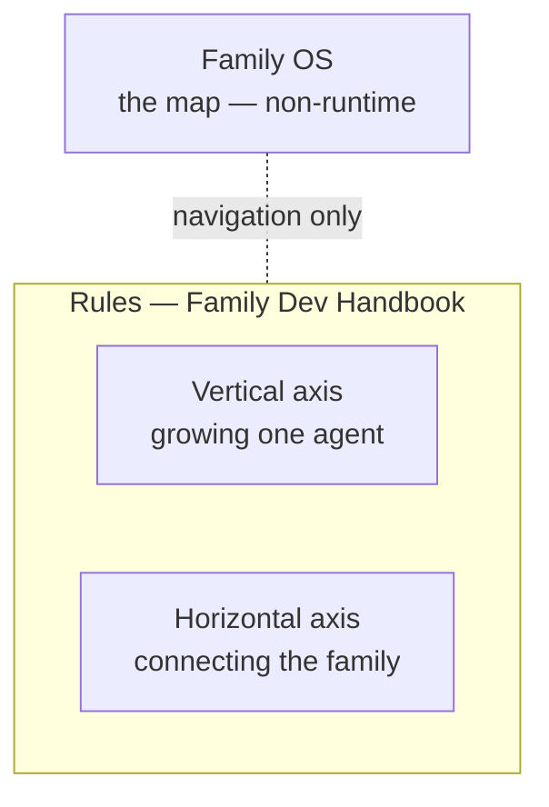
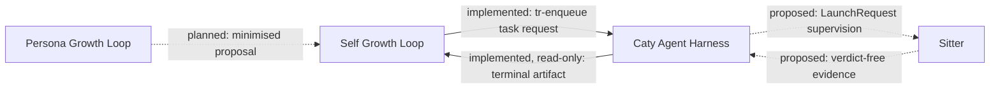

# Family OS — engineering documentation

[← Back to the entrance](../README.md)

This page is the technical view of the map. It assumes you are comfortable with agents, processes, and contracts. If you want the plain-language version, the entrance covers the same ground without the vocabulary.

The exact contract — every authority, every edge, every failure posture — lives in [the full reference](reference.md). This page explains the shape; that page pins it down.

---

## What this repository is

Family OS is a **non-runtime plane**: policy, map, pointers, and rendered observation. It ships nothing you install, starts no process on your machine, opens no port, and stores no credential. The only code in the repository is `tools/`, which regenerates these pages from `registry/modules.json` and checks that what they claim is still true.

The practical consequence is the part worth internalising:

- **Every runtime module must make progress with this repository deleted.** If a module needs the map to run, the map has become a controller and the design is broken.
- **Nothing here is a registry.** There is no service discovery, no callback path, no liveness verdict.
- **Nothing here copies a module's contract.** Each module's own repository is canonical for its behaviour; this repository holds a pointer and the freshness of that pointer.

Family OS answers exactly one question authoritatively: *is this document current according to its own freshness metadata?* Everything else it renders belongs to someone else.

---

## The three layers

| Layer | Answers | Canonical home |
| --- | --- | --- |
| Rules | how parallel work stays safe — issues, branches, worktrees, handoffs | [Family Dev Handbook](https://github.com/caty-ai/family-dev-handbook) |
| Vertical | how one agent remembers, finishes, and grows | [Caty Agent Harness](https://github.com/caty-ai/caty-agent-harness) plus growth loops |
| Horizontal | how several agents share memory and hand work over | [Family Memory Architecture](https://github.com/caty-ai/family-memory-architecture) and [Sitter](https://github.com/caty-ai/sitter) |

The rules layer sits **above** both axes rather than inside either one. It is a document, not a program: it constrains how humans and agents develop the modules, and it enforces nothing at runtime.

---

## Module inventory

<!-- family:generated:module-inventory:start -->
| Module | Class | Owns | State |
| --- | --- | --- | --- |
| [Family Dev Handbook](https://github.com/caty-ai/family-dev-handbook) | non-runtime governance | issue, PR, worktree, handoff, and parallel-development rules | published, MIT |
| [Caty Agent Harness](https://github.com/caty-ai/caty-agent-harness) | runtime, vertical foundation | task meaning, attempt, retry, checkpoint, done-check, completion, dead-letter | published, MIT |
| [context-kit](https://github.com/caty-ai/context-kit) | runtime, desk equipment | bounded tool output and scratch persistence, delegation-brief validation, destructive/public-repo/credential guards, one agent's memory recall | published, MIT |
| [Persona Engine](https://github.com/caty-ai/persona-engine) | runtime, standalone | persona layers and emotion gradation | published, MIT |
| [Persona Growth Loop](https://github.com/shojikumaru/persona-growth-loop) | planned frontend | minimised, idempotent proposal production | publication in preparation; planned |
| [X Collector](https://github.com/caty-ai/x-collector) | runtime, optional input | collecting external material for the ability loop | published, MIT |
| [Self Growth Loop](https://github.com/caty-ai/self-growth-loop) | runtime, application | proposal, governance, adoption records, growth interpretation | published, MIT |
| [Family Memory Architecture](https://github.com/caty-ai/family-memory-architecture) | runtime, horizontal infrastructure | the memory bus; registered schedule expectation, check-in, provenance | published, MIT |
| [Sitter](https://github.com/caty-ai/sitter) | runtime, observation | local process and reply facts, dispatch-attempt evidence, delegated same-attempt restart | published, MIT |
<!-- family:generated:module-inventory:end -->

This table is generated from [`registry/modules.json`](../registry/modules.json). Links marked *publication in preparation* cannot be opened yet. They are listed so the map stays honest about what exists and where it will live.

Persona Engine and X Collector are usable on their own and are not required by anything else. X Collector is the current default input path into the ability loop, not the only possible one — it is replaceable.

---

## How the pieces connect

Only two cross-module edges are implemented today. Everything else is either a shape with no consumer yet, or a boundary owned by someone outside the family.

The implemented pair is worth reading closely, because it is the template for every later edge:

- **Request flows toward the module that owns the next decision.** Self Growth Loop enqueues a task; it never writes task state, attempt numbers, retry policy, or dead-letter status. Those belong to the harness.
- **Evidence flows back without transferring authority.** The harness publishes a correlated terminal artifact. Terminal does **not** mean adopted, applied, or effective — those are three further facts owned by three further parties.

Requests and evidence travel in opposite directions and neither carries permission with it. If you remember one sentence from this page, make it that one.

---

## Claim states

Every statement in [the reference](reference.md) carries one of four states. They are not decoration; they decide what you are allowed to build on.

- **implemented** — an interface that exists today, backed by evidence
- **decided** — an accepted boundary or practice, not necessarily code
- **proposed** — a shape only; it is not authorisation to implement
- **unknown** — no fact may be inferred until the sole authority answers

A proposed edge may not acquire a consumer until its contract owner has recorded version negotiation, migration, and rollback or downgrade behaviour. Reading a shape as a green light is the most expensive mistake available here.

---

## What Family OS never does

These are structural refusals, not current limitations. They do not expire when the project grows.

- **No runtime edge.** There is no arrow from Family OS or the handbook into any runtime module. Adding one would make the map a controller.
- **No authority capture.** Rendering another module's fact never moves ownership of that fact.
- **No invented completion.** When an optional or proposed edge is absent, the result is preserved local progress or `unknown` — never a synthesised success.
- **No secrets.** Credentials, schedulers, and break-glass paths belong to whoever owns the deployment.

The words that cause the most damage are the ambiguous ones. `returned`, `ack`, `delivered`, `healthy`, `adopted`, `applied`, and `effective` each have exactly one owner, and they are split apart deliberately in [the reference](reference.md#vocabulary).

---

## If you remove a piece

A good way to test whether a boundary is real is to delete the module and ask what actually breaks.

| Remove | You lose | You keep |
| --- | --- | --- |
| Family OS | coordination visibility | every runtime module, unchanged |
| Family Dev Handbook | development guidance | runtime operation |
| Family Memory Architecture | shared memory and check-in observation | each module's own domain state |
| Sitter | optional external supervision | the harness's task semantics and local failure posture |
| Self Growth Loop | growth governance and interpretation | tasks and evidence in the harness |
| Persona Growth Loop | a future proposal input | everything currently running |

Nothing in the top half of that table takes runtime state with it. That is the whole point of the layering.

---

## Supported environments

Reading the map needs nothing but a Markdown viewer. The table below covers the modules the map points to.

| Aspect | Support |
| --- | --- |
| Reading this map | ✅ macOS ／ ✅ Windows ／ ✅ Linux |
| Agent environments in real use | ✅ Claude Code ／ ✅ Hermes Agent ／ ✅ OpenClaw |
| Agent environments planned for verification | ⚠️ Kimi Code ／ ⚠️ Codex |

> **Note:** "in real use" means the related mechanisms are actually run in that environment. It is not a guarantee that every Family OS module is fully supported there. Measured 2026-07-28. Per-module support is owned by each module's own README.

---

## Where to go next

| You want | Go to |
| --- | --- |
| The exact contract — authorities, edges, failure postures | [Full reference](reference.md) |
| Third-party parts that work well alongside these | [Recommended stack](recommended-stack.md) |
| The visual rules for the README and its images | [README visual system](readme-visual-system.md) |
